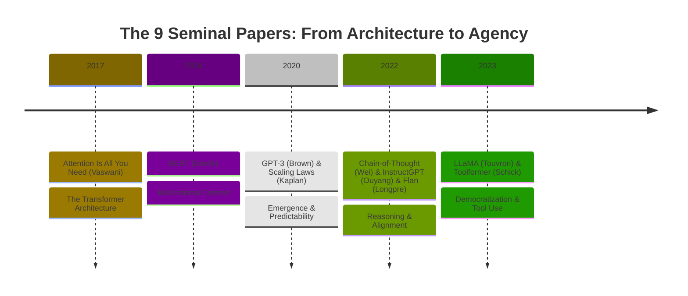
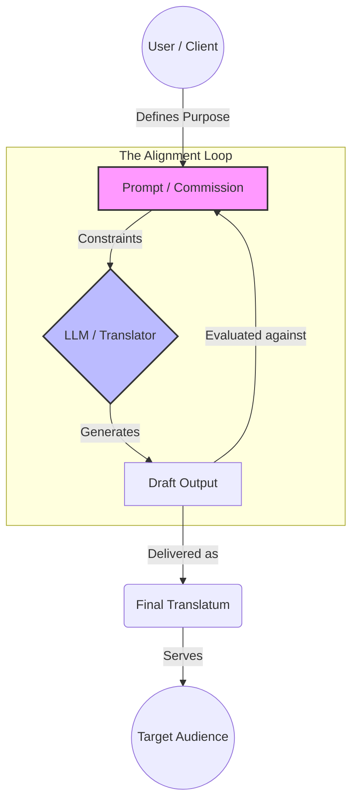
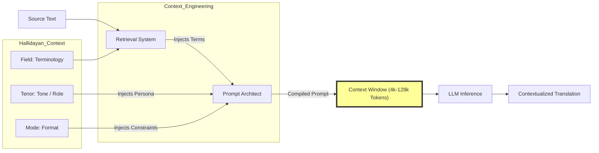
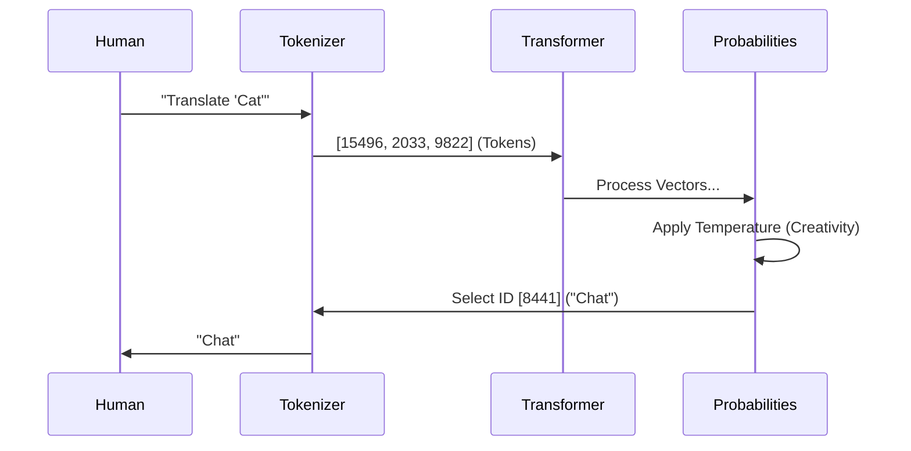

# Visual Assets (Mermaid Diagrams)

## 1. The Evolutionary Arc of LLMs
*A timeline visualization of the 9 Seminal Papers reviewed in Phase II.*

---

## 2. The Skopos Prompting Triangle
*Visualizing the relationship between the User (Client), the Prompt (Brief), and the Model (Translator), based on Nord/Vermeer.*

---

## 3. Context Engineering: The Hallidayan Injection
*How to force "World Context" into the "Context Window" using RAG (Retrieval Augmented Generation).*

---

## 4. The LLM Processing Pipeline (Simplified)
*A pedagogical view of how text becomes numbers and back to text.*

## 5. Semantic Scholar + ConnectedPapers Network (Live)
<iframe class="widget" src="data/network_manifests/combined_network_widget.html" title="TS-LLM knowledge graph"></iframe>

> **Build note**: Run `python script/build_semantic_widgets.py` after refreshing Semantic Scholar or ConnectedPapers data. The script regenerates the per-paper widgets, merges them with any ConnectedPapers payloads, and emits `data/network_manifests/combined_network_widget.html` for embedding here and in `white_paper.html`.

---
## Cross-References
- [[outline]]
- [[References]]
- [[General_Terminology]]
