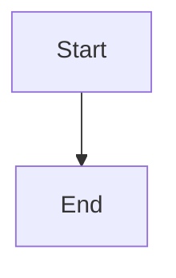

# Troubleshooting

This guide helps you resolve common issues when working with the TS-LLM Knowledge Stack.

## Documentation Build Issues

### Sphinx Build Fails

**Problem**: `sphinx-build` command fails with errors

**Solution**:

1. Check Python version:
```bash
python --version  # Should be 3.8+
```

2. Reinstall dependencies:
```bash
pip install -r docs/requirements.txt --force-reinstall
```

3. Clean build directory:
```bash
cd docs
make clean
make html
```

### Missing Extensions

**Problem**: `Extension error: Could not import extension`

**Solution**:

```bash
# Install missing extension
pip install sphinx-extension-name

# Verify installation
pip list | grep sphinx
```

### Theme Not Found

**Problem**: `Theme 'sphinx_rtd_theme' not found`

**Solution**:

```bash
pip install sphinx-rtd-theme
```

## MyST Parser Issues

### Markdown Not Rendering

**Problem**: Markdown files not being processed

**Solution**:

Check `conf.py` has MyST parser configured:

```python
extensions = [
    'myst_parser',
    # ... other extensions
]

source_suffix = {
    '.rst': 'restructuredtext',
    '.md': 'markdown',
}
```

### Directives Not Working

**Problem**: MyST directives like `{note}` not rendering

**Solution**:

Enable MyST extensions in `conf.py`:

```python
myst_enable_extensions = [
    "colon_fence",
    "deflist",
    "html_image",
    "html_admonition",
]
```

## Mermaid Diagrams

### Diagrams Not Rendering

**Problem**: Mermaid diagrams show as plain text

**Solution**:

1. Verify CDN script in `conf.py`:
```python
html_js_files = [
    'https://cdn.jsdelivr.net/npm/mermaid@10/dist/mermaid.min.js',
]
```

2. Initialize Mermaid in custom JavaScript:
```javascript
// _static/js/mermaid-init.js
mermaid.initialize({ startOnLoad: true });
```

### Syntax Errors in Diagrams

**Problem**: Mermaid diagram fails to render

**Solution**:

Validate syntax using [Mermaid Live Editor](https://mermaid.live):



Common issues:
- Missing semicolons in older syntax
- Incorrect arrow syntax (use `-->` not `->`)
- Special characters in node text (use quotes)

## API Documentation

### autodoc Not Finding Modules

**Problem**: `autodoc: failed to import module`

**Solution**:

1. Add project to Python path in `conf.py`:
```python
import os
import sys
sys.path.insert(0, os.path.abspath('../..'))
```

2. Verify module can be imported:
```bash
python -c "import lumache; print(lumache.__file__)"
```

### Type Hints Not Showing

**Problem**: Type annotations not displayed in docs

**Solution**:

Ensure `sphinx-autodoc-typehints` is configured:

```python
extensions = [
    'sphinx.ext.autodoc',
    'sphinx_autodoc_typehints',
]

autodoc_typehints = 'description'
```

## ReadTheDocs Build Failures

### Build Timeout

**Problem**: ReadTheDocs build times out

**Solution**:

1. Optimize build process:
```yaml
# .readthedocs.yaml
build:
  os: "ubuntu-22.04"
  tools:
    python: "3.10"
  jobs:
    post_install:
      - pip install --upgrade pip
```

2. Reduce dependency installation time:
```bash
# Use binary wheels
pip install --only-binary :all: package-name
```

### Import Errors on ReadTheDocs

**Problem**: Module imports fail on ReadTheDocs but work locally

**Solution**:

Mock imports in `conf.py`:

```python
autodoc_mock_imports = [
    'numpy',
    'pandas',
    'tensorflow',
]
```

### Missing Static Files

**Problem**: Images or CSS not appearing on ReadTheDocs

**Solution**:

1. Verify files are in `_static/`:
```bash
ls docs/source/_static/
```

2. Check `html_static_path` in `conf.py`:
```python
html_static_path = ['_static']
```

## Obsidian Integration

### Sync Issues

**Problem**: Changes in Obsidian not syncing to repository

**Solution**:

```bash
# Check git status
git status

# Add and commit changes
git add .
git commit -m "Update notes"
git push
```

### Broken Links

**Problem**: Links broken after moving notes

**Solution**:

1. Use Obsidian's "Detect broken links" feature
2. Update links manually or use find-replace
3. Run link checker:
```bash
python scripts/check_links.py
```

### Plugin Conflicts

**Problem**: Obsidian plugins causing issues

**Solution**:

1. Disable plugins one by one to identify conflict
2. Update plugins to latest versions
3. Check plugin compatibility with Obsidian version

## Knowledge Graph

### Graph Build Errors

**Problem**: Knowledge graph construction fails

**Solution**:

```bash
# Check input data format
python -m knowledge_graph validate data/

# Rebuild graph
python -m knowledge_graph build --force
```

### Query Performance

**Problem**: Graph queries are slow

**Solution**:

1. Add indexes:
```python
graph.create_index('entity_type')
graph.create_index('relationship_type')
```

2. Limit query depth:
```python
result = graph.traverse(
    start='node_id',
    max_depth=2  # Limit depth
)
```

3. Enable caching:
```python
graph.enable_cache(size=1000)
```

## Installation Issues

### Permission Errors

**Problem**: `Permission denied` during installation

**Solution**:

```bash
# Use user installation
pip install --user -r requirements.txt

# Or use virtual environment
python -m venv venv
source venv/bin/activate  # On Windows: venv\Scripts\activate
pip install -r requirements.txt
```

### Dependency Conflicts

**Problem**: Conflicting package versions

**Solution**:

1. Create fresh virtual environment:
```bash
python -m venv venv_new
source venv_new/bin/activate
pip install -r requirements.txt
```

2. Use dependency resolver:
```bash
pip install --upgrade pip
pip install -r requirements.txt --use-feature=fast-deps
```

## General Debugging

### Enable Debug Mode

Add to `conf.py`:

```python
# Debug mode
DEBUG = True
verbose = True
```

### Check Logs

```bash
# Sphinx build logs
cat docs/build/build.log

# ReadTheDocs build logs
# Available in ReadTheDocs dashboard
```

### Verbose Output

```bash
# Build with verbose output
sphinx-build -v -b html docs/source docs/build/html

# Extra verbose
sphinx-build -vv -b html docs/source docs/build/html
```

## Getting Help

If you're still experiencing issues:

1. **Check existing issues**: Search GitHub issues for similar problems
2. **Create an issue**: Include:
   - Error message (full traceback)
   - Python version
   - Operating system
   - Steps to reproduce
3. **Ask the community**: 
   - Stack Overflow with `[sphinx]` tag
   - ReadTheDocs community forum

## Common Error Messages

### `ModuleNotFoundError: No module named 'xxx'`

**Solution**: Install missing module
```bash
pip install xxx
```

### `WARNING: html_static_path entry '_static' does not exist`

**Solution**: Create the directory
```bash
mkdir -p docs/source/_static
```

### `Extension error: Could not import extension`

**Solution**: Verify extension name and installation
```bash
pip list | grep sphinx
pip install sphinx-extension-name
```

### `Theme error: no theme named 'xxx' found`

**Solution**: Install theme package
```bash
pip install sphinx-xxx-theme
```

## Performance Optimization

### Slow Builds

1. **Enable parallel builds**:
```bash
make html SPHINXOPTS="-j auto"
```

2. **Use incremental builds**:
```bash
# Only rebuild changed files
make html
```

3. **Disable expensive extensions during development**:
```python
# conf.py
extensions = [
    'sphinx.ext.autodoc',  # Keep essential ones
    # 'expensive_extension',  # Comment out temporarily
]
```

### Large Documentation Sets

1. **Split into multiple documents**
2. **Use `.. toctree::` with `:maxdepth:`**
3. **Lazy load heavy content**

## Best Practices

:::{tip}
**Prevention**
- Keep dependencies up to date
- Test builds locally before pushing
- Use virtual environments
- Document custom configurations
:::

:::{tip}
**Debugging**
- Start with verbose output
- Check logs systematically
- Isolate the problem
- Test in clean environment
:::

## See Also

- {doc}`getting_started` - Initial setup guide
- {doc}`repository_structure` - Understanding the codebase
- {doc}`build_pipeline` - Build system documentation
