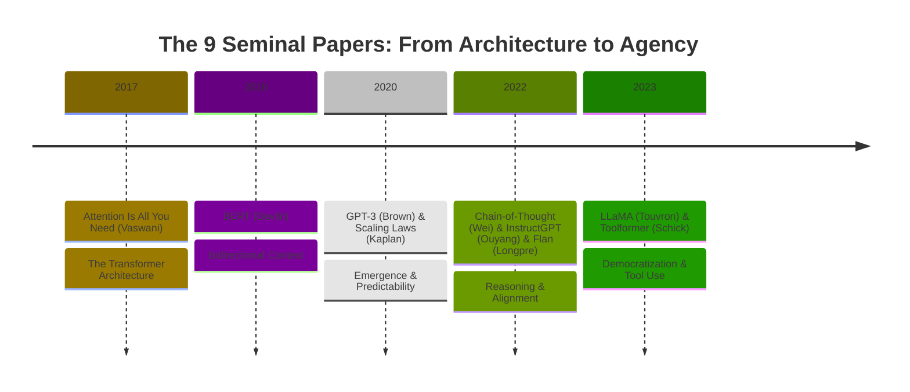
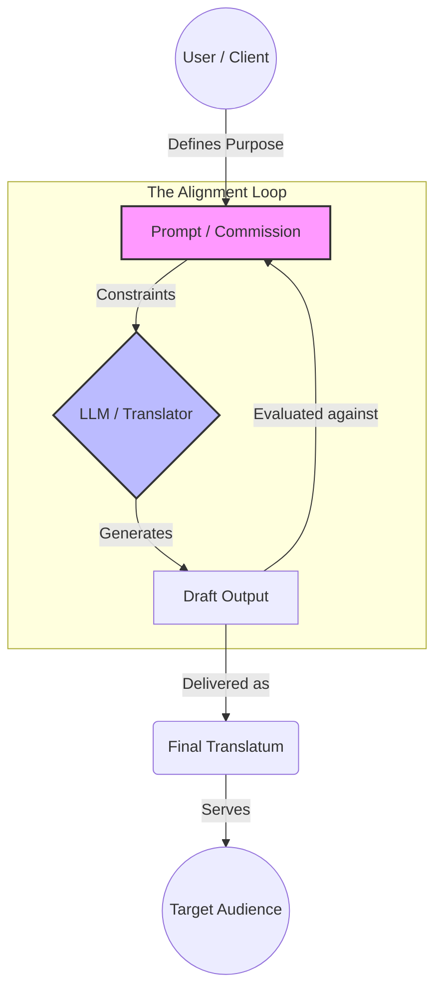
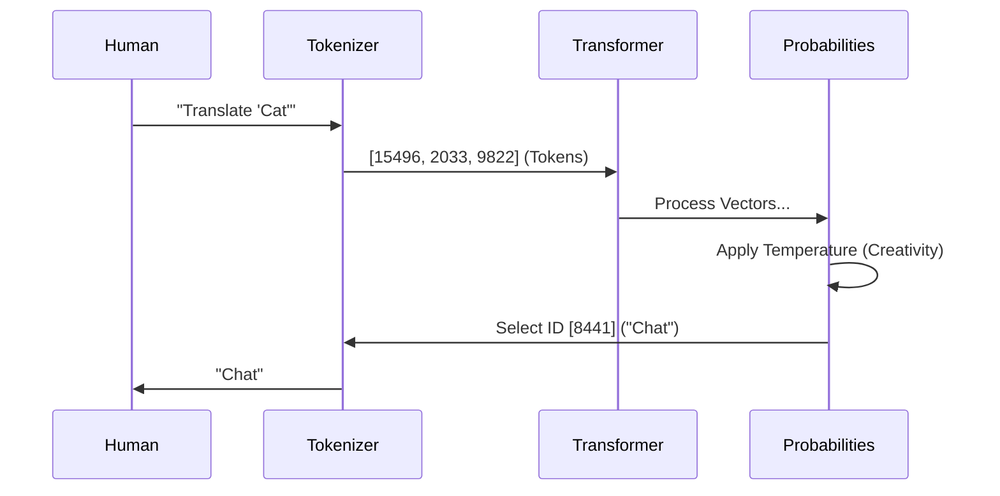

```markdown
```markdown
---
title: "Visual_Assets.md"
tags: [Visuals, Diagrams, Mermaid, Obsidian]
author: "AI Assistant"
date: 2025-12-02
file_constraints: "Obsidian-native Mermaid.js definitions for project concepts"
---

# Technical Implementation Plan: Visual Assets
- [x] **Format Selection**: Use **Mermaid.js** (Standard Obsidian Diagramming) to ensuring editable, vector-based graphics directly in the note.
- [x] **Concept Mapping**: 
    1.  **Timeline**: Visualizing the 9 Papers.
    2.  **Process**: The Skopos Prompting Loop.
    3.  **Architecture**: The Context Engineering Flow.
- [ ] **Next Step**: Await answers to clarification questions regarding Dataset formatting.

---

# Visual Assets (Mermaid Diagrams)

## 1. The Evolutionary Arc of LLMs
*A timeline visualization of the 9 Seminal Papers reviewed in Phase II.*



---

## 2. The Skopos Prompting Triangle
*Visualizing the relationship between the User (Client), the Prompt (Brief), and the Model (Translator), based on Nord/Vermeer.*



---

## 3. Context Engineering: The Hallidayan Injection
*How to force "World Context" into the "Context Window" using RAG (Retrieval Augmented Generation).*

```mermaid
flowchart LR
    Source[Source Text]
    
    subgraph "Hallidayan Context (The World)"
    Field[Field: Terminology]
    Tenor[Tenor: Tone/Role]
    Mode[Mode: Format]
    end
    
    subgraph "Context Engineering"
    RAG[Retrieval System]
    PromptEng[Prompt Architect]
    end
    
    Source --> RAG
    Field --> RAG
    
    RAG -->|Injects Terms| PromptEng
    Tenor -->|Injects Persona| PromptEng
    Mode -->|Injects Constraints| PromptEng
    
    PromptEng -->|Compiled Prompt| Window[[Context Window (4k-128k Tokens)]]
    Window --> Model((LLM Inference))
    Model --> Output[Contextualized Translation]
    
    style Window fill:#ff9,stroke:#333,stroke-width:4px
```

---

## 4. The LLM Processing Pipeline (Simplified)
*A pedagogical view of how text becomes numbers and back to text.*



## 5. ConnectedPapers Interactive Graph (Prototype)
<iframe class="widget" src="data/connected_papers/manual_1_widget.html" title="ConnectedPapers graph (demo)"></iframe>

> **Note**: This demo uses the `TEST_TOKEN` graph (DeepFruits paper) to validate the pipeline while we collect Semantic Scholar ShaIDs for the TS corpus. Once ShaIDs are added to `data/reference_metadata.json`, re-run `script/connected_papers.py` and replace this iframe with the translator-specific graph.

### Manifest + Embedding Notes
- `data/semantic_scholar/widgets/manifest_semanticscholar_widgets.json` (`.csv` twin) lists every Semantic Scholar widget along with node/edge counts for captions.
- `data/network_manifests/graph_manifest_combined.json` unifies Semantic Scholar + ConnectedPapers sources for downstream publishing.
- Regenerate everything via `/home/ben/Documents/BİLKENT_LLM/.venv/bin/python script/build_semantic_widgets.py --force` to refresh both manifests and HTML outputs.

## 6. Semantic Scholar Interactive Graphs
Each iframe references the row noted in `manifest_semanticscholar_widgets.json`. Collapsible sections keep the Obsidian note light while still embedding the full HTML asset for GitHub Pages.

<details>
<summary><strong>Row 001_Bowker_2023</strong> · 9 nodes / 8 edges</summary>
<iframe class="widget" src="data/semantic_scholar/widgets/001_Bowker_2023_semanticscholar_widget.html" title="Semantic Scholar graph: Bowker 2023"></iframe>
</details>

<details>
<summary><strong>Row 002_Brown_2020</strong> · 1,140 nodes / 1,139 edges</summary>
<iframe class="widget" src="data/semantic_scholar/widgets/002_Brown_2020_semanticscholar_widget.html" title="Semantic Scholar graph: Brown 2020 (GPT-3)"></iframe>
</details>

<details>
<summary><strong>Row 003_Devlin_2019</strong> · 1,060 nodes / 1,059 edges</summary>
<iframe class="widget" src="data/semantic_scholar/widgets/003_Devlin_2019_semanticscholar_widget.html" title="Semantic Scholar graph: Devlin 2019 (BERT)"></iframe>
</details>

<details>
<summary><strong>Row 004_Halliday_1978</strong> · 1,001 nodes / 1,000 edges</summary>
<iframe class="widget" src="data/semantic_scholar/widgets/004_Halliday_1978_semanticscholar_widget.html" title="Semantic Scholar graph: Halliday 1978"></iframe>
</details>

<details>
<summary><strong>Row 005_House_2015</strong> · 73 nodes / 72 edges</summary>
<iframe class="widget" src="data/semantic_scholar/widgets/005_House_2015_semanticscholar_widget.html" title="Semantic Scholar graph: House 2015"></iframe>
</details>

<details>
<summary><strong>Row 006_Jurafsky_2024</strong> · 1,001 nodes / 1,000 edges</summary>
<iframe class="widget" src="data/semantic_scholar/widgets/006_Jurafsky_2024_semanticscholar_widget.html" title="Semantic Scholar graph: Jurafsky 2024"></iframe>
</details>

<details>
<summary><strong>Row 007_Kaplan_2020</strong> · 1,051 nodes / 1,050 edges</summary>
<iframe class="widget" src="data/semantic_scholar/widgets/007_Kaplan_2020_semanticscholar_widget.html" title="Semantic Scholar graph: Kaplan 2020"></iframe>
</details>

<details>
<summary><strong>Row 008_Kenny_2022</strong> · 2 nodes / 1 edge</summary>
<iframe class="widget" src="data/semantic_scholar/widgets/008_Kenny_2022_semanticscholar_widget.html" title="Semantic Scholar graph: Kenny 2022"></iframe>
</details>

<details>
<summary><strong>Row 009_Koehn_2010</strong> · 1,032 nodes / 1,031 edges</summary>
<iframe class="widget" src="data/semantic_scholar/widgets/009_Koehn_2010_semanticscholar_widget.html" title="Semantic Scholar graph: Koehn 2010"></iframe>
</details>

<details>
<summary><strong>Row 010_Koehn_2020</strong> · 656 nodes / 655 edges</summary>
<iframe class="widget" src="data/semantic_scholar/widgets/010_Koehn_2020_semanticscholar_widget.html" title="Semantic Scholar graph: Koehn 2020"></iframe>
</details>

<details>
<summary><strong>Row 011_Longpre_2023</strong> · 913 nodes / 912 edges</summary>
<iframe class="widget" src="data/semantic_scholar/widgets/011_Longpre_2023_semanticscholar_widget.html" title="Semantic Scholar graph: Longpre 2023"></iframe>
</details>

<details>
<summary><strong>Row 012_Mikolov_2013</strong> · 1,022 nodes / 1,021 edges</summary>
<iframe class="widget" src="data/semantic_scholar/widgets/012_Mikolov_2013_semanticscholar_widget.html" title="Semantic Scholar graph: Mikolov 2013"></iframe>
</details>

<details>
<summary><strong>Row 013_Nord_1997</strong> · 1,001 nodes / 1,000 edges</summary>
<iframe class="widget" src="data/semantic_scholar/widgets/013_Nord_1997_semanticscholar_widget.html" title="Semantic Scholar graph: Nord 1997"></iframe>
</details>

<details>
<summary><strong>Row 014_Ouyang_2022</strong> · 1,080 nodes / 1,079 edges</summary>
<iframe class="widget" src="data/semantic_scholar/widgets/014_Ouyang_2022_semanticscholar_widget.html" title="Semantic Scholar graph: Ouyang 2022 (InstructGPT)"></iframe>
</details>

<details>
<summary><strong>Row 015_Reiss_2013</strong> · 770 nodes / 769 edges</summary>
<iframe class="widget" src="data/semantic_scholar/widgets/015_Reiss_2013_semanticscholar_widget.html" title="Semantic Scholar graph: Reiss 2013"></iframe>
</details>

<details>
<summary><strong>Row 016_Schick_2023</strong> · 1,054 nodes / 1,053 edges</summary>
<iframe class="widget" src="data/semantic_scholar/widgets/016_Schick_2023_semanticscholar_widget.html" title="Semantic Scholar graph: Schick 2023 (Toolformer)"></iframe>
</details>

<details>
<summary><strong>Row 017_Touvron_2023</strong> · 1,077 nodes / 1,076 edges</summary>
<iframe class="widget" src="data/semantic_scholar/widgets/017_Touvron_2023_semanticscholar_widget.html" title="Semantic Scholar graph: Touvron 2023 (LLaMA)"></iframe>
</details>

<details>
<summary><strong>Row 018_Vaswani_2017</strong> · 1,040 nodes / 1,039 edges</summary>
<iframe class="widget" src="data/semantic_scholar/widgets/018_Vaswani_2017_semanticscholar_widget.html" title="Semantic Scholar graph: Vaswani 2017 (Transformer)"></iframe>
</details>

<details>
<summary><strong>Row 019_Wei_2022</strong> · 1,095 nodes / 1,094 edges</summary>
<iframe class="widget" src="data/semantic_scholar/widgets/019_Wei_2022_semanticscholar_widget.html" title="Semantic Scholar graph: Wei 2022 (Chain-of-Thought)"></iframe>
</details>

<details open>
<summary><strong>Row all_sources</strong> · 14,300 nodes / 16,058 edges</summary>
<iframe class="widget" src="data/semantic_scholar/widgets/all_sources_semanticscholar_widget.html" title="Semantic Scholar graph: Aggregate Corpus"></iframe>
</details>

## 7. Combined Corpus Network (Semantic Scholar + ConnectedPapers)
<iframe class="widget" src="data/network_manifests/combined_network_widget.html" title="Combined network widget"></iframe>

> Caption: Uses `data/network_manifests/graph_manifest_combined.json` to merge every Semantic Scholar widget with any available ConnectedPapers graphs; rerun `script/build_semantic_widgets.py --force` after new ConnectedPapers API harvests to refresh this overlay.

