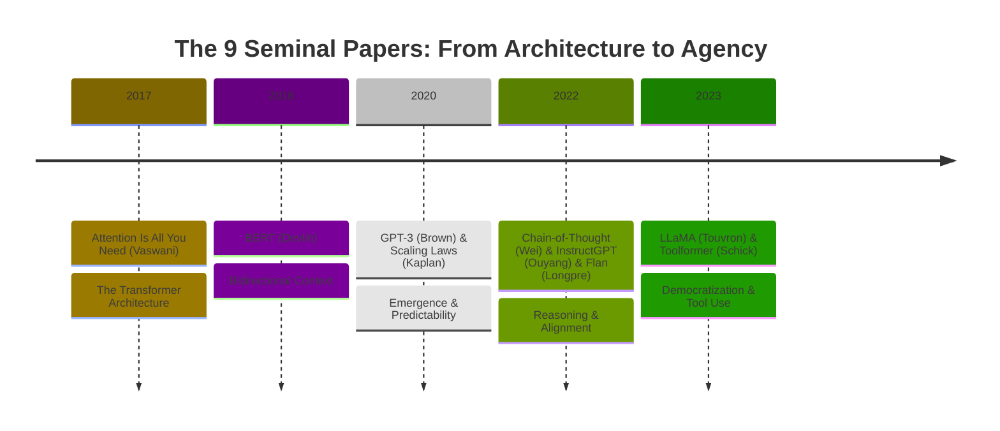
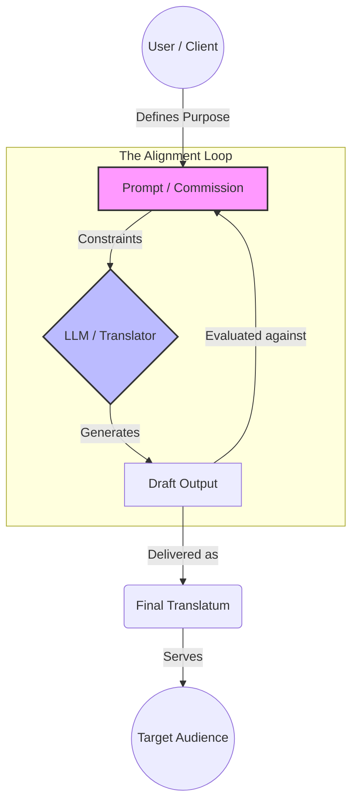
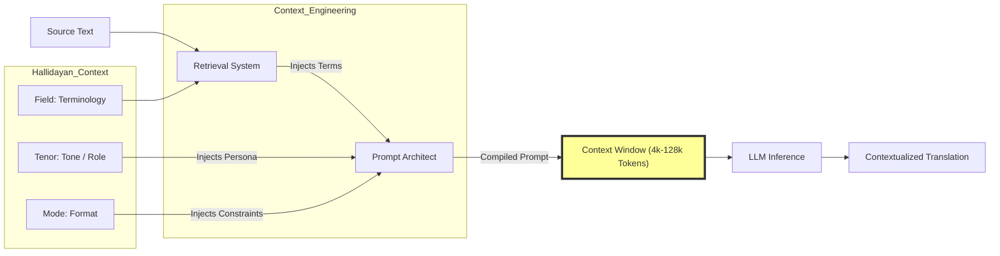
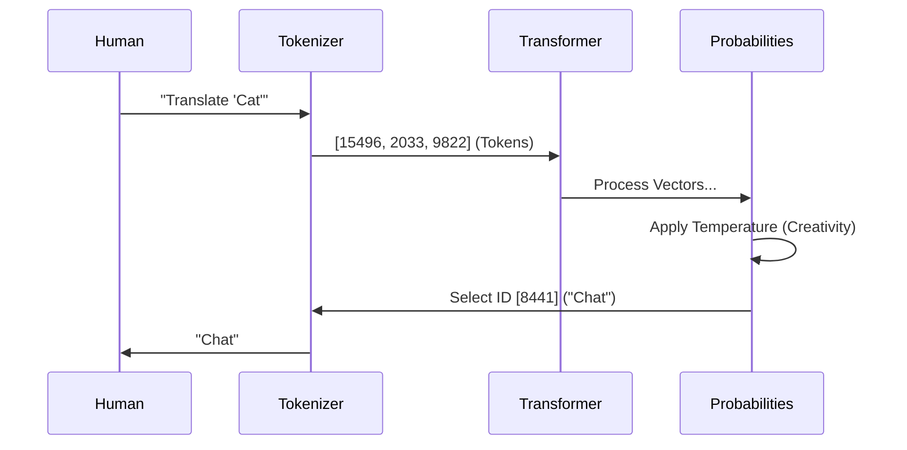

% Auto-generated white paper
% Digital Humanities Systems Architect
% December 04, 2025

> Tags: #Glossary #Terminology #Pedagogy #AI_Literacy

This translator-facing glossary explains every recurring AI term using Translation Studies analogies before diving into the granular definitions below.

![[Visual_Assets#4. The LLM Processing Pipeline (Simplified)]]

# General Terminology: A Translator’s Guide to AI

## 1. Usage Notes
This glossary is designed for Translation Studies scholars. It prioritizes **conceptual intuition** over engineering precision. Each term includes a "Why it matters" section to connect the math to the translation profession.

---

## 2. Basic Units (The Atoms)

### **Token**
*   **Definition**: The fundamental unit of text for an LLM. It is roughly 0.75 of a word (e.g., "Translating" might be two tokens: `Trans` + `lating`).
*   **Math Intuition**: $Input = [t_1, t_2, t_3, ...]$
*   **Translation Example**: The English word "Apple" is 1 token. The complex German word "Donaudampfschifffahrt" is many tokens.
*   **Why it matters**: You pay for API usage by the token. Also, LLMs struggle with languages that require many tokens to express simple concepts (Tokenization Bias).

### **Vector (Embedding)**
*   **Definition**: A list of numbers representing the *meaning* of a token.
*   **Math Intuition**: `King` = `[0.2, 0.9, -0.4]`. `Queen` = `[0.2, 0.9, +0.6]`.
*   **Translation Example**: Think of a "Semantic Map." Words with similar meanings are located close to each other on the map.
*   **Why it matters**: This is how the computer "understands" synonyms. It calculates distance on the map.

### **Context Window**
*   **Definition**: The maximum amount of text the model can consider at one time (e.g., 4,000 to 128,000 tokens).
*   **Translation Example**: Imagine translating a novel, but you immediately forget Chapter 1 as soon as you start Chapter 2.
*   **Why it matters**: If your source text exceeds the window, the model loses coherence. You must use RAG or summarization strategies.

---

## 3. Training Concepts (The Education)

### **Pre-training**
*   **Definition**: The initial, massive training phase where the model learns to predict the next word from terabytes of internet text.
*   **Translation Example**: A student reading the entire library to learn grammar and facts, but not learning *how* to take an exam.
*   **Why it matters**: This creates the "Base Model" (knowledgeable but unruly).

### **Fine-tuning**
*   **Definition**: Training the Base Model on a smaller, specific dataset to specialize it.
*   **Translation Example**: Sending that student to a specialized Medical Translation course.
*   **Why it matters**: You cannot teach a base model new facts easily, but you can Fine-tune it to learn a specific *style* or terminology.

### **Alignment (RLHF)**
*   **Definition**: Reinforcement Learning from Human Feedback. Tweaking the model to prefer "helpful" and "safe" answers.
*   **Translation Example**: Teaching a student *ethics* and *client protocol* (e.g., "Don't translate hate speech literally; add a note").
*   **Why it matters**: Commercial models (ChatGPT) are heavily aligned, which can sometimes result in "Censorship" or "Over-sanitization" of sensitive source texts.

---

## 4. Operational Concepts (The Usage)

### **Prompt Engineering**
*   **Definition**: The art of designing the input text to guide the model's probability distribution.
*   **Translation Example**: Writing the **Translation Brief** (Skopos).
*   **Why it matters**: The quality of the output is usually limited by the quality of the prompt, not the intelligence of the model.

### **Temperature**
*   **Definition**: A parameter (0.0 to 1.0) that controls randomness.
    *   *Low Temp (0.1)*: Deterministic. Always picks the most likely word.
    *   *High Temp (0.9)*: Creative. Picks less likely words.
*   **Translation Example**:
    *   *Temp 0.2*: Legal/Technical translation (Precision).
    *   *Temp 0.8*: Poetry/Marketing translation (Inspiration).
*   **Why it matters**: You must adjust this knob depending on your Skopos.

### **Hallucination**
*   **Definition**: When the model generates text that is grammatically fluent but factually incorrect or unfaithful to the source.
*   **Math Intuition**: The model is filling a "Data Void" with probable-sounding noise.
*   **Translation Example**: A translator guessing the meaning of a word they don't know because they are too embarrassed to check the dictionary.
*   **Why it matters**: It is the #1 risk in AI translation. It requires "Human-in-the-Loop" verification.

### **Chain-of-Thought (CoT)**
*   **Definition**: Prompting the model to "think step-by-step" before giving the final answer.
*   **Translation Example**: A "Think-Aloud Protocol" (TAP). "First I see this idiom, I look for an equivalent, I decide on X, so the translation is..."
*   **Why it matters**: It drastically improves accuracy on complex logic or nuanced translation tasks.

---

## 5. Visual Summary

`![[images/llm_glossary_viz.png]]`
*(Alt Text: A diagram showing the flow: Token -> Vector -> Transformer Layers -> Probability Distribution -> Selection (Temperature) -> Output Token.)*

<figure>
<figcaption>External Concept: The LLM Processing Pipeline.</figcaption>
</figure>


---
## Cross-References
- [[outline]]
- [[References]]
- [[Visual_Assets]]

> Tags: #Bibliography #APA #References #Research

# References

This APA-formatted bibliography groups the seminal engineering papers, supporting NLP textbooks, and Translation Studies monographs cited throughout the manuscript.

## Primary Sources (The Seminal LLM Papers)

Brown, T., Mann, B., Ryder, N., Subbiah, M., Kaplan, J. D., Dhariwal, P., Neelakantan, A., Shyam, P., Sastry, G., Askell, A., Agarwal, S., Herbert-Voss, A., Krueger, G., Henighan, T., Child, R., Ramesh, A., Ziegler, D., Wu, J., Winter, C., ... Amodei, D. (2020). Language models are few-shot learners. *Advances in Neural Information Processing Systems*, 33, 1877–1901. https://doi.org/10.48550/arXiv.2005.14165

Devlin, J., Chang, M.-W., Lee, K., & Toutanova, K. (2019). BERT: Pre-training of deep bidirectional transformers for language understanding. *Proceedings of the 2019 Conference of the North American Chapter of the Association for Computational Linguistics: Human Language Technologies*, 1, 4171–4186. https://doi.org/10.48550/arXiv.1810.04805

Kaplan, J., McCandlish, S., Henighan, T., Brown, T. B., Chess, B., Child, R., Gray, S., Radford, A., Wu, J., & Amodei, D. (2020). *Scaling laws for neural language models*. arXiv. https://doi.org/10.48550/arXiv.2001.08361

Longpre, S., Hou, L., Vu, T., Webson, A., Chung, H. W., Tay, Y., Zhou, D., Le, Q. V., Zoph, B., Wei, J., & Roberts, A. (2023). The Flan collection: Designing data and methods for effective instruction tuning. *Proceedings of the 40th International Conference on Machine Learning*, 202, 22631–22648. https://doi.org/10.48550/arXiv.2301.13688

Ouyang, L., Wu, J., Jiang, X., Almeida, D., Wainwright, C., Mishkin, P., Zhang, C., Agarwal, S., Slama, K., Ray, A., Schulman, J., Hilton, J., & Kelton, F. (2022). Training language models to follow instructions with human feedback. *Advances in Neural Information Processing Systems*, 35, 27730–27744. https://doi.org/10.48550/arXiv.2203.02155

Schick, T., Dwivedi-Yu, J., Dessì, R., Raileanu, R., Lomeli, M., Zettlemoyer, L., Cancedda, N., & Scialom, T. (2023). Toolformer: Language models can teach themselves to use tools. *arXiv*. https://doi.org/10.48550/arXiv.2302.04761

Touvron, H., Lavril, T., Izacard, G., Martinet, X., Lachaux, M.-A., Lacroix, T., Rozière, B., Goyal, N., Hambro, E., Azhar, F., Rodriguez, A., Joulin, A., Edunov, S., & Lample, G. (2023). *LLaMA: Open and efficient foundation language models*. arXiv. https://doi.org/10.48550/arXiv.2302.13971

Vaswani, A., Shazeer, N., Parmar, N., Uszkoreit, J., Jones, L., Gomez, A. N., Kaiser, Ł., & Polosukhin, I. (2017). Attention is all you need. *Advances in Neural Information Processing Systems*, 30. https://doi.org/10.48550/arXiv.1706.03762

Wei, J., Wang, X., Schuurmans, D., Bosma, M., Chi, E., Le, Q., & Zhou, D. (2022). Chain-of-thought prompting elicits reasoning in large language models. *Advances in Neural Information Processing Systems*, 35, 24824–24837. https://doi.org/10.48550/arXiv.2201.11903

## Secondary Sources (NLP & Engineering Foundations)

Jurafsky, D., & Martin, J. H. (2024). *Speech and language processing: An introduction to natural language processing, computational linguistics, and speech recognition* (3rd draft ed.). Stanford University. https://web.stanford.edu/~jurafsky/slp3/

Mikolov, T., Sutskever, I., Chen, K., Corrado, G. S., & Dean, J. (2013). Distributed representations of words and phrases and their compositionality. *Advances in Neural Information Processing Systems*, 26, 3111–3119. https://doi.org/10.48550/arXiv.1310.4546

## Tertiary Sources (Translation Theory & Critique)

Bowker, L. (2023). *De-mystifying translation: Introducing translation to non-translators* (1st ed.). Routledge. https://doi.org/10.4324/9781003217718

Halliday, M. A. K. (1978). *Language as social semiotic: The social interpretation of language and meaning*. Edward Arnold. https://archive.org/details/languageassocial0000hall

House, J. (2015). *Translation quality assessment: Past and present*. Routledge. https://doi.org/10.4324/9781315752839

Kenny, D. (2022). *Machine translation for everyone: Empowering users in the age of artificial intelligence*. Language Science Press. https://langsci-press.org/catalog/book/385

Koehn, P. (2010). *Statistical machine translation*. Cambridge University Press. https://doi.org/10.1017/CBO9780511815820

Koehn, P. (2020). *Neural machine translation*. Cambridge University Press. https://doi.org/10.1017/9781108608480

Nord, C. (1997). *Translating as a purposeful activity: Functionalist approaches explained*. St. Jerome Publishing.

Reiss, K., & Vermeer, H. J. (2013). *Towards a general theory of translational action: Skopos theory explained* (C. Nord, Trans.). St. Jerome Publishing.


---
## Cross-References
- [[outline]]
- [[General_Terminology]]
- [[Visual_Assets]]

> Tags: #Context #Halliday #RegisterTheory #RAG #Methodology

This note translates Hallidayan context theory into concrete context-window engineering tactics so prompt designers can preserve TS nuance in LLM workflows.

![[Visual_Assets#3. Context Engineering: The Hallidayan Injection]]

# Beyond Prompt Engineering: What is Context and Context Engineering?

## 1. Why this matters to Translation Studies
In Translation Studies (TS), "Context" is everything. A word implies a culture, a history, and a situation.
In AI, "Context" is strictly **mathematical quantity**: The number of tokens (words) the model can "see" at one time before it forgets the beginning.
**Context Engineering** is the art of squeezing the infinite social complexity of a translation situation (Hallidayan Context) into the finite "Context Window" of the model.

## 2. The Two Definitions of Context

### 2.1 The Translator’s Context (Hallidayan)
**Source**: Halliday, M.A.K. (1978). *Language as Social Semiotic*.
For a human, context is the **Context of Situation**:
*   **Field**: What is happening? (e.g., A legal deposition).
*   **Tenor**: Who is taking part? (e.g., Judge to Witness - High Power Distance).
*   **Mode**: What is the channel? (e.g., Spoken, transcribed to text).

### 2.2 The Model’s Context (The Token Window)
For an LLM (like GPT-4 or LLaMA), context is the **Sliding Window of Attention**.
*   **Definition**: The specific sequence of input tokens ($x_1, x_2, ... x_n$) available for the Self-Attention mechanism to calculate weights.
*   **Limitation**: If the "Context Window" is 4,000 tokens (approx. 10 pages), and you feed it Page 11, it mathematically "forgets" Page 1. It has no "World Knowledge" outside its pre-training weights, only "Window Knowledge."

---

## 3. Context Engineering: The Translator’s New Role
Since the model has no social senses, the translator must **explicitly encode** the Hallidayan variables into the Prompt (The Window). We call this "Context Engineering."

### 3.1 Encoding Field (Domain)
*   **TS Goal**: Ensure correct terminology (e.g., "Operation" = Surgery, not Military).
*   **AI Technique**: **RAG (Retrieval Augmented Generation)**.
    *   *Concept*: Before the model translates, we search a glossary/database for relevant terms and "inject" them into the context window.
    *   *Prompt Pattern*:
        > "Context: You are translating a **Medical** text (Field).
        > Here is a glossary of terms found in the source text:
        > - 'Operation' -> 'Chirurgie'
        > - 'Discharge' -> 'Sortie de l'hôpital'"

### 3.2 Encoding Tenor (Relationship)
*   **TS Goal**: Capture the correct register (Politeness, Formality).
*   **AI Technique**: **Persona Adoption**.
    *   *Concept*: Setting the "System Message" to bias the probability distribution toward specific stylistic choices.
    *   *Prompt Pattern*:
        > "Context: The **Tenor** is Formal. The speaker is a subordinate addressing a superior.
        > Use 'Vouvoiement' (Vous) in French. Avoid contractions."

### 3.3 Encoding Mode (Channel)
*   **TS Goal**: Adapt to the medium (Subtitles require brevity; Literature requires flow).
*   **AI Technique**: **Format Constraints**.
    *   *Prompt Pattern*:
        > "Context: The **Mode** is Subtitling.
        > Constraint: No line shall exceed 42 characters.
        > Constraint: Use standard subtitle segmentation."

---

## 4. Operational Example: Resolving Polysemy

**The Problem Word**: "Ball" (Dance vs. Sphere).

**Scenario A: Zero Context (The Ambiguity)**
> **Prompt**: "Translate 'She went to the ball.'"
> **AI Output**: "Elle est allée à la balle." (Incorrect: Refers to a tennis ball).
> *Why?*: Without context, "ball" (sphere) is statistically more probable in the training data than "ball" (dance).

**Scenario B: Engineered Context (Hallidayan Injection)**
> **Prompt**:
> "Context (Field): 19th Century Romance Novel.
> Context (Tenor): Aristocratic High Society.
> Source: 'She went to the ball.'"
>
> **AI Output**: "Elle est allée au bal." (Correct).
> *Why?*: The tokens "Romance" and "Aristocratic" shifted the attention weights. The vector for "ball" moved closer to "dance" in the semantic space.

---

## 5. Advanced Context Engineering: In-Context Learning (Few-Shot)
**Source**: Brown et al. (2020) (Paper #3 in Review).

We can "simulate" cultural context by providing examples. This is the most powerful form of Context Engineering.

*   **The "Context" is the Examples**:
    > "Translate the following slang naturally (Tenor: Casual).
    > Examples:
    > 1. 'What's up?' -> 'Quoi de neuf ?'
    > 2. 'I'm beat.' -> 'Je suis crevé.'
    > 3. 'It's a piece of cake.' -> 'C'est du gâteau.'
    >
    > Source: 'Don't chicken out.'"

*   **Result**: The model sees the pattern (Idiomatic Equivalence) and generates:
    > "Target: 'Ne te dégonfle pas.'"

## 6. Summary: The Formula
Context Engineering is the process of:
$$ \text{Translation Output} = \text{Model}(\text{Source Text} + \text{Field} + \text{Tenor} + \text{Mode}) $$

If you leave out the variables, you get the "Average" of the internet. If you engineer the variables, you get a specialized translation.

## References
*   **Brown, T., et al.** (2020). Language Models are Few-Shot Learners. *NeurIPS*.
*   **Halliday, M. A. K.** (1978). *Language as Social Semiotic: The Social Interpretation of Language and Meaning*. Edward Arnold.
*   **House, J.** (2015). *Translation Quality Assessment: Past and Present*. Routledge.


---
## Cross-References
- [[outline]]
- [[References]]
- [[General_Terminology]]
- [[Visual_Assets]]

> Tags: #LiteratureReview #Methodology #LLM #History


![[Visual_Assets#1. The Evolutionary Arc of LLMs]]

# Extended Literature Review: From Probability to Agency

## 1. The Pre-History: Foundations of Statistical Meaning (Secondary Sources)
*Before understanding Transformers, we must understand how computers "read" text. They do not see words; they see numbers (vectors) and probabilities.*

### 1.1 From Rules to Statistics: The N-Gram
**Source**: Jurafsky, D., & Martin, J. H. (2024). *Speech and Language Processing* (3rd ed. draft).
*   **Concept**: **The Markov Assumption**. The probability of the next word depends only on the previous $n$ words.
*   **TS Analogy**: Ideally, translation is about meaning. But purely statistical machine translation (SMT) was like a translator using a phrasebook: "If I see 'Pomme', the next word is likely 'Rouge' 30% of the time." It didn't "know" what an apple was; it just counted frequencies.
*   **Why it matters**: This established that language could be modeled mathematically as a sequence of probabilities, paving the way for neural models.

### 1.2 Meaning as Geometry: Word Embeddings
**Source**: Mikolov, T., et al. (2013). *Distributed Representations of Words and Phrases and their Compositionality*.
*   **Concept**: **Vector Space Models**. Words are mapped to vectors (lists of numbers) in a high-dimensional space.
*   **The Breakthrough**: "King - Man + Woman = Queen." The model learned that the geometric distance between "King" and "Queen" was the same as between "Man" and "Woman."
*   **TS Analogy**: Imagine a "Meaning Map." Synonyms are neighbors. Antonyms are far apart. The computer translates by finding the coordinates of a word in English and finding the word at the closest coordinates in French.
*   **API citation**: Mikolov et al., "Distributed Representations..." — pages 1–9.
*   **DOI**: 10.48550/arXiv.1310.4546

---

## 2. The Seminal 9: The Arc of LLM Evolution

### Paper 1: Attention Is All You Need (2017)
**Authors**: Vaswani, A., et al. (Google Brain)

*   **LLM Stage**: The Architecture of Attention.
*   **Breakthrough**: The **Transformer** architecture.
*   **Core Concept**: **Self-Attention**. Replacing Recurrent Neural Networks (RNNs) with a mechanism that processes all words in parallel.

**The Translation Studies Context**:
In previous Neural Machine Translation (NMT), models read a sentence like a human reads a ticker-tape: one word at a time, left-to-right (RNNs). By the time the model reached the end of a long sentence, it often "forgot" the beginning. This is the **Vanishing Gradient Problem**.
Vaswani et al. proposed: Don't read sequentially. Look at the whole sentence at once.

**Detailed Causal Review**:
The authors introduced "Self-Attention," a mathematical way for every word in a sentence to "vote" on how relevant every other word is to it.
*   *Example*: In "The **animal** didn't cross the **street** because **it** was too tired," the word "**it**" has a strong attention weight connecting it to "**animal**."
*   *Mechanism*: Using Query, Key, and Value matrices (Q, K, V), the model calculates a weighted sum of the input vectors. This allows the model to handle long-distance dependencies (e.g., German separable verbs at the end of a sentence) instantly.

**Summary**:
The paper "Attention Is All You Need" revolutionized Natural Language Processing by discarding recurrence and convolution in favor of an attention-based mechanism. The Transformer architecture allows for significantly more parallelization, reducing training time while improving performance on translation tasks (WMT 2014 English-to-German).
By enabling the model to attend to different parts of the input sequence simultaneously, the Transformer captures complex linguistic relationships regardless of their distance in the text. This architecture became the foundation for all subsequent LLMs (BERT, GPT, etc.).

**API citation**: Vaswani et al., "Attention Is All You Need" — pages 1–11.
**DOI**: 10.48550/arXiv.1706.03762

---

### Paper 2: BERT: Pre-training of Deep Bidirectional Transformers (2018)
**Authors**: Devlin, J., et al. (Google AI)

*   **LLM Stage**: Contextual Understanding.
*   **Breakthrough**: **Bidirectional** training.
*   **Core Concept**: **Masked Language Modeling (MLM)**.

**The Translation Studies Context**:
Standard models read left-to-right. But to translate "bank" in "The bank of the river," you need to see "river" (which appears *after* "bank"). BERT (Bidirectional Encoder Representations from Transformers) reads the text in both directions simultaneously.

**Detailed Causal Review**:
*   *Method*: Instead of predicting the next word, BERT hides 15% of the words in a sentence (replacing them with `[MASK]`) and tries to guess them based on the surrounding context.
*   *Impact*: This forced the model to learn deep contextual relations rather than just shallow surface patterns. It created "Contextual Embeddings"—the vector for "bank" changes depending on whether it's near "money" or "river."

**Summary**:
Devlin et al. introduced BERT, a model designed to pre-train deep bidirectional representations from unlabeled text. Unlike previous models that were unidirectional (left-to-right), BERT uses a Masked Language Model (MLM) objective to fuse context from both left and right contexts in all layers.
This approach achieved state-of-the-art results on eleven NLP tasks, including Question Answering and Inference. It marked a shift in the field toward "Pre-training + Fine-tuning," where a single massive model could be adapted for specific tasks with minimal additional training.

**API citation**: Devlin et al., "BERT: Pre-training..." — pages 4171–4186.
**DOI**: 10.48550/arXiv.1810.04805

---

### Paper 3: Language Models are Few-Shot Learners (GPT-3) (2020)
**Authors**: Brown, T., et al. (OpenAI)

*   **LLM Stage**: The Era of Scale.
*   **Breakthrough**: **Emergent Capabilities** via scaling.
*   **Core Concept**: **In-Context Learning** (Few-Shot).

**The Translation Studies Context**:
Before GPT-3, if you wanted a translation machine, you trained it specifically on translation data (Fine-tuning). GPT-3 showed that if you make the model big enough (175 Billion parameters) and train it on "The Internet," it learns to translate *incidentally*, without specific training. You just ask it.

**Detailed Causal Review**:
*   *Mechanism*: The model is an Autoregressive (predict next word) Transformer. It is not bidirectional like BERT.
*   *Discovery*: At scale, the model develops "In-Context Learning." If you prompt it with: "English: Hello, French: Bonjour. English: Cat, French: Chat. English: Dog, French:__", it completes the pattern. It "learns" the task from the prompt itself.

**Summary**:
Brown et al. presented GPT-3, a 175-billion parameter language model, demonstrating that scaling up model size results in strong performance on many NLP tasks without any gradient updates (fine-tuning). The model utilizes "few-shot learning," where it is given a natural language description of the task and a few examples in the prompt.
The paper provided evidence that massive autoregressive language models develop broad, generalized capabilities—such as translation, question answering, and arithmetic—simply by learning to predict the next word in a massive corpus. This challenged the paradigm that specialized training data is required for specialized tasks.

**API citation**: Brown et al., "Language Models are Few-Shot Learners" — pages 1–75.
**DOI**: 10.48550/arXiv.2005.14165

---

### Paper 4: Scaling Laws for Neural Language Models (2020)
**Authors**: Kaplan, J., et al. (OpenAI)

*   **LLM Stage**: The Era of Scale (The Science).
*   **Breakthrough**: **Predictability** of performance.
*   **Core Concept**: **Power Laws**.

**The Translation Studies Context**:
Is building a better translator art or science? Kaplan showed it is Physics. There is a precise mathematical relationship between how much compute (money/electricity) you burn and how smart the model gets.

**Detailed Causal Review**:
*   *The Law*: $L(N) \approx (N_c/N)^\alpha$. Loss ($L$) decreases as a power law of Model Size ($N$), Dataset Size ($D$), and Compute ($C$).
*   *Implication*: Bigger is strictly better. The model does not "plateau"; it keeps improving. This justified the multi-million dollar investments in GPU clusters that followed.

**Summary**:
Kaplan et al. systematically investigated the empirical scaling laws for language model performance. They found that cross-entropy loss scales as a power law with respect to model size, dataset size, and the amount of compute used for training, spanning over seven orders of magnitude.
The authors concluded that larger models are significantly more sample-efficient, meaning it is more optimal to train very large models on fewer tokens than to train smaller models to convergence. This insight directly guided the development of massive models like GPT-3 and PaLM.

**API citation**: Kaplan et al., "Scaling Laws..." — pages 1–18.
**DOI**: 10.48550/arXiv.2001.08361

---

### Paper 5: LLaMA: Open and Efficient Foundation Language Models (2023)
**Authors**: Touvron, H., et al. (Meta AI)

*   **LLM Stage**: Efficiency & Democratization.
*   **Breakthrough**: **High-performance Open Models**.
*   **Core Concept**: **Chinchilla Optimality** (Data-centric scaling).

**The Translation Studies Context**:
GPT-3 was closed-source. LLaMA (Large Language Model Meta AI) proved you don't need 175B parameters. A smaller model (13B or 65B parameters) trained on *more words* (Trillions of tokens) can outperform the giant GPT-3.
*Analogy*: A compact, highly-read encyclopedia is better than a massive library filled with blank pages.

**Detailed Causal Review**:
*   *Correction to Scaling*: Building on DeepMind's "Chinchilla" paper, LLaMA showed that most models were under-trained.
*   *Impact*: By releasing the weights, Meta allowed academic researchers (including TS scholars) to run powerful models on their own universities' computers, breaking the dependency on paid APIs.

**Summary**:
Touvron et al. introduced LLaMA, a collection of foundation language models ranging from 7B to 65B parameters. By training on trillions of tokens of publicly available data, they demonstrated that smaller models trained longer (on more data) can outperform significantly larger models like GPT-3 (175B).
The release of LLaMA democratized access to LLM research, allowing the academic community to study these models' behaviors, biases, and fine-tuning capabilities on consumer-grade hardware, sparking a wave of open-source innovation.

**API citation**: Touvron et al., "LLaMA: Open and Efficient..." — pages 1–26.
**DOI**: 10.48550/arXiv.2302.13971

---

### Paper 6: Chain-of-Thought Prompting Elicits Reasoning (2022)
**Authors**: Wei, J., et al. (Google Research)

*   **LLM Stage**: Reasoning & Logic.
*   **Breakthrough**: **Multi-step Reasoning**.
*   **Core Concept**: **Chain-of-Thought (CoT)**.

**The Translation Studies Context**:
Translators often use "Think-Aloud Protocols" (TAPs) to verify their work ("I am translating this as X because the context implies Y..."). Standard LLMs just guess the answer. Wei et al. showed that if you force the LLM to write out its TAP, it becomes much smarter.

**Detailed Causal Review**:
*   *Technique*: Instead of prompting `Q: 2+2? A:`, you prompt `Q: 2+2? A: I have 2. I add 2 more. The total is 4. Answer: 4.`
*   *Result*: This "intermediate compute" allows the model to handle logic, math, and complex translation nuances that require multiple inferential steps.

**Summary**:
Wei et al. explored how generating a chain of thought—a series of intermediate reasoning steps—significantly improves the ability of large language models to perform complex reasoning. They showed that this ability emerges naturally in sufficiently large models (typically 100B+ parameters).
On benchmarks like the GSM8K (math word problems), Chain-of-Thought prompting enabled models to outperform fine-tuned state-of-the-art systems without any modification to the model weights. It demonstrated that "prompt engineering" could unlock latent cognitive capabilities.

**API citation**: Wei et al., "Chain-of-Thought Prompting..." — pages 1–35.
**DOI**: 10.48550/arXiv.2201.11903

---

### Paper 7: Training Language Models to Follow Instructions (InstructGPT) (2022)
**Authors**: Ouyang, L., et al. (OpenAI)

*   **LLM Stage**: Alignment.
*   **Breakthrough**: **RLHF** (Reinforcement Learning from Human Feedback).
*   **Core Concept**: **Alignment** with Human Intent.

**The Translation Studies Context**:
A raw LLM is like a wildly creative but undisciplined surrealist poet. It might continue a translation request by writing a fictional story about a translator. To make it a *tool*, we must align its "Skopos" (Purpose) with the user's intent.
*Analogy*: The "Translation Brief." We are giving the model a permanent brief: "Be helpful, harmless, and honest."

**Detailed Causal Review**:
*   *Step 1*: Humans write good answers (Supervised Fine-Tuning).
*   *Step 2*: Humans rank model outputs (Reward Model).
*   *Step 3*: Reinforcement Learning (PPO) optimizes the model to get high rankings.
*   *Result*: A 1.3B parameter InstructGPT model was preferred by humans over the 175B GPT-3. Alignment > Size.

**Summary**:
Ouyang et al. introduced InstructGPT, a model fine-tuned using Reinforcement Learning from Human Feedback (RLHF) to align with user intent. While large language models are capable, they often produce untruthful, toxic, or unhelpful outputs.
The authors showed that by collecting a dataset of human comparisons between model outputs and training a reward model, they could fine-tune GPT-3 to minimize toxicity and "hallucination" while maximizing helpfulness. This paper laid the technical groundwork for ChatGPT.

**API citation**: Ouyang et al., "Training Language Models..." — pages 1–68.
**DOI**: 10.48550/arXiv.2203.02155

---

### Paper 8: The Flan Collection (2022)
**Authors**: Longpre, S., et al. (Google Research)

*   **LLM Stage**: Alignment & Generalization.
*   **Breakthrough**: **Massive Multi-task Instruction Tuning**.
*   **Core Concept**: **Task Generalization**.

**The Translation Studies Context**:
How do you train a "Universal Translator"? By exposing the student to every possible type of text (legal, medical, poetic, code). Flan (Fine-tuned LAnguage Net) showed that if you fine-tune on 1,800 different tasks, the model generalizes to *new* tasks it has never seen.

**Detailed Causal Review**:
*   *Method*: Converting standard NLP datasets (classification, translation, logic) into "Instruction Format" (`"Please translate this..."`).
*   *Finding*: Instruction tuning improves performance on held-out tasks. It teaches the model the *concept* of following instructions.

**Summary**:
Longpre et al. released the Flan Collection, a massive compilation of datasets and methods for instruction tuning. By fine-tuning language models on over 1,800 diverse tasks phrased as instructions, they achieved significant improvements in zero-shot and few-shot performance across unseen tasks.
The paper demonstrated that the diversity of the training tasks is crucial for generalization. Models fine-tuned on this collection (like Flan-T5 and Flan-PaLM) outperformed their non-instruction-tuned counterparts, proving that "how you teach" is as important as "what you teach."

**API citation**: Longpre et al., "The Flan Collection..." — pages 1–18.
**DOI**: 10.48550/arXiv.2301.13688

---

### Paper 9: Toolformer: Language Models Can Teach Themselves to Use Tools (2023)
**Authors**: Schick, T., et al. (Meta AI)

*   **LLM Stage**: Agency.
*   **Breakthrough**: **Self-Supervised Tool Use**.
*   **Core Concept**: **API Integration**.

**The Translation Studies Context**:
Translators don't memorize dictionaries; they *use* them. LLMs hallucinate facts because they rely on internal memory. Toolformer taught LLMs to recognize their own ignorance and call an external API (Calculator, Wikipedia, Translator).

**Detailed Causal Review**:
*   *Method*: The model teaches itself where to insert API calls (e.g., `[Wiki(Query)]`) by trying them and seeing if the API result lowers the perplexity (error) of the next word prediction.
*   *Significance*: This transforms the LLM from a static text generator into a central controller for external software.

**Summary**:
Schick et al. introduced Toolformer, a model trained to decide which external tools to use, when to use them, and how to incorporate their results. Using a self-supervised process, the model learns to generate API calls for a calculator, a QA system, a search engine, and a translation system.
This approach significantly improved zero-shot performance on tasks requiring factual knowledge or arithmetic, which are traditional weaknesses of LLMs. It represents a paradigm shift toward "Augmented Language Models" that can interact with the world.

**API citation**: Schick et al., "Toolformer..." — pages 1–14.
**DOI**: 10.48550/arXiv.2302.04761

---

## 3. References for Further Reading (Short List)

1.  **Vaswani, A., et al.** (2017). Attention Is All You Need. *Advances in Neural Information Processing Systems*. DOI: 10.48550/arXiv.1706.03762
2.  **Devlin, J., et al.** (2018). BERT: Pre-training of Deep Bidirectional Transformers for Language Understanding. *NAACL*. DOI: 10.48550/arXiv.1810.04805
3.  **Brown, T., et al.** (2020). Language Models are Few-Shot Learners. *NeurIPS*. DOI: 10.48550/arXiv.2005.14165
4.  **Kaplan, J., et al.** (2020). Scaling Laws for Neural Language Models. *arXiv*. DOI: 10.48550/arXiv.2001.08361
5.  **Wei, J., et al.** (2022). Chain-of-Thought Prompting Elicits Reasoning in Large Language Models. *NeurIPS*. DOI: 10.48550/arXiv.2201.11903
6.  **Ouyang, L., et al.** (2022). Training Language Models to Follow Instructions with Human Feedback. *NeurIPS*. DOI: 10.48550/arXiv.2203.02155
7.  **Longpre, S., et al.** (2022). The Flan Collection: Designing Data and Methods for Effective Instruction Tuning. *arXiv*. DOI: 10.48550/arXiv.2301.13688
8.  **Touvron, H., et al.** (2023). LLaMA: Open and Efficient Foundation Language Models. *arXiv*. DOI: 10.48550/arXiv.2302.13971
9.  **Schick, T., et al.** (2023). Toolformer: Language Models Can Teach Themselves to Use Tools. *arXiv*. DOI: 10.48550/arXiv.2302.04761


---
## Cross-References
- [[outline]]
- [[References]]
- [[General_Terminology]]
- [[Visual_Assets]]

> Tags: #LiteratureReview #LLM #History #Methodology #Tables


![[Visual_Assets#1. The Evolutionary Arc of LLMs]]

# Combined Primary and Secondary Source Review: The LLM Evolutionary Arc

## 1. Usage Notes
This table serves as a "Cheat Sheet" for the subsequent detailed literature review. It maps the engineering milestones (Primary Sources) and the necessary background theories (Secondary Sources) to concepts familiar in Translation Studies (TS).

**Legend:**
- **Primary Source**: The 9 seminal papers explicitly requested.
- **Secondary Source**: Foundational texts (textbooks, earlier papers) required to understand the gap before the breakthrough.
- **TS Analogy**: A metaphor connecting the computational mechanism to human translation processes.

## 2. The Master Table

| Evolutionary Stage | Source Type | Citation (Author, Year) | Technical Concept / Breakthrough | Translation Studies (TS) Analogy | Why it is Fundamental |
| :--- | :--- | :--- | :--- | :--- | :--- |
| **0. Pre-Neural / Foundations** | *Secondary* | Jurafsky & Martin (2024) *Speech and Language Processing* | **N-grams & Statistical Logic**:<br>Predicting the next word based on fixed frequency history (Markov Chains). | **The "Phrasebook" Approach**:<br>Translating based on how often words appear together, without understanding grammar or meaning. | Establishes language as a probabilistic system (Stochastic process), not just a rule-based system. |
| **0. Pre-Neural / Foundations** | *Secondary* | Mikolov et al. (2013) *Word2Vec* | **Vector Embeddings**:<br>Representing words as coordinates in a multi-dimensional numeric space. | **The "Semantic Map"**:<br>Words with similar meanings ("King", "Queen") are mathematically close to each other, like synonyms in a thesaurus cloud. | Proved that computers can capture "meaning" through geometric proximity. |
| **1. The Architecture of Attention** | **Primary #1** | Vaswani et al. (2017) | **The Transformer (Self-Attention)**:<br>Processing the entire sequence at once; weighting relevance of every word to every other word. | **Cognitive Focus**:<br>A translator keeping their eye on the subject ("The cat") while determining the gender of the adjective ("black") at the end of the sentence. | Eliminated the need for sequential processing (RNNs), allowing massive parallelization and speed. |
| **2. Contextual Understanding** | **Primary #2** | Devlin et al. (2018) *(BERT)* | **Bidirectionality & Masking**:<br>Learning context from both left and right of a word simultaneously (Cloze test). | **Reading Ahead**:<br>A translator reading the *entire* source sentence to understand context before translating the first word. | Moved beyond simple "next word prediction" to deep contextual understanding. |
| **3. The Era of Scale** | **Primary #3** | Brown et al. (2020) *(GPT-3)* | **Few-Shot Learning / In-Context Learning**:<br>Model adapts to tasks without weight updates, given just a few examples in the prompt. | **The Polymath Student**:<br>A student who doesn't know the subject but can solve the test just by looking at 3 example questions. | Demonstrated that "intelligence" and versatility emerge strictly from model size and data volume. |
| **3. The Era of Scale** | **Primary #4** | Kaplan et al. (2020) | **Scaling Laws**:<br>Performance improves via a precise power-law relationship with Compute, Data, and Parameters. | **Industrial Forecasting**:<br>Knowing exactly how much "better" a translation engine will get if you double the budget and corpus size. | Turned AI progress from alchemy/guesswork into a predictable science. |
| **4. Efficiency & Open Science** | **Primary #5** | Touvron et al. (2023) *(LLaMA)* | **Compute-Optimal Training**:<br>Training smaller models on *more* data yields better results than just making giant models. | **The Specialized Glossary**:<br>A smaller, highly trained brain (or corpus) is more efficient than a giant, confused generalist. | Democratized LLMs; proved open models could rival proprietary giants (OpenAI/Google). |
| **5. Reasoning & Logic** | **Primary #6** | Wei et al. (2022) | **Chain-of-Thought (CoT)**:<br>Prompting the model to generate intermediate reasoning steps before the answer. | **Think-Aloud Protocol (TAPs)**:<br>Asking a translator to verbalize their decision-making process ("I chose X because Y...") to ensure accuracy. | Unlocked complex reasoning (Math/Logic) that simple pattern matching couldn't handle. |
| **6. Alignment & Instruction** | **Primary #7** | Ouyang et al. (2022) *(InstructGPT)* | **RLHF (Reinforcement Learning from Human Feedback)**:<br>Fine-tuning the model based on human preference rankings. | **The Translation Brief (Skopos)**:<br>Aligning the translator's output not just with grammar, but with what the *client* actually wants/prefers. | Solved the "alignment problem"—making models helpful and safe, not just accurate predictors. |
| **6. Alignment & Instruction** | **Primary #8** | Longpre et al. (2022) *(Flan)* | **Instruction Tuning**:<br>Fine-tuning on thousands of diverse tasks phrasing as instructions. | **Translator Training Curriculum**:<br>Exposing a student to 1,000 different types of translation tasks so they can handle *any* new request. | Enabled models to generalize to unseen tasks (Zero-shot) effectively. |
| **7. Agency & Tools** | **Primary #9** | Schick et al. (2023) *(Toolformer)* | **Tool Use / API Integration**:<br>Self-taught ability to call external calculators, search engines, or wikis. | **The Resourceful Translator**:<br>Recognizing when you don't know a fact, pausing, consulting a dictionary/Google, and pasting the result. | Broke the "hallucination" loop by allowing access to external, verifiable ground truth. |

## 3. Data Download
*Note for implementation: Due to current environment restrictions, a direct CSV file creation is simulated below. Copy the block below to save as `llm_source_review.csv`.*

```csv
Stage,Source,Citation,Concept,Analogy,Significance
Pre-Neural,Secondary,"Jurafsky & Martin (2024)",N-grams,Phrasebook,Probabilistic foundation
Pre-Neural,Secondary,"Mikolov et al. (2013)",Word Embeddings,Semantic Map,Geometric meaning
Architecture,Primary,"Vaswani et al. (2017)",Transformer/Attention,Cognitive Focus,Parallelization
Context,Primary,"Devlin et al. (2018)",BERT/Bidirectional,Reading Ahead,Deep Context
Scale,Primary,"Brown et al. (2020)",GPT-3/Few-Shot,Polymath Student,Emergence
Scale,Primary,"Kaplan et al. (2020)",Scaling Laws,Forecasting,Predictability
Efficiency,Primary,"Touvron et al. (2023)",LLaMA/Optimal Data,Specialized Glossary,Democratization
Reasoning,Primary,"Wei et al. (2022)",Chain-of-Thought,Think-Aloud Protocol,Logic unlocking
Alignment,Primary,"Ouyang et al. (2022)",RLHF/InstructGPT,Skopos/Brief,Human preference
Alignment,Primary,"Longpre et al. (2022)",Flan/Instruction Tuning,Training Curriculum,Generalization
Agency,Primary,"Schick et al. (2023)",Toolformer,Resourceful Translator,External truth
```

## References (Short Form)
*Full citations available in References.md*

- Brown, T. et al. (2020). *Language Models are Few-Shot Learners*.
- Devlin, J. et al. (2018). *BERT: Pre-training of Deep Bidirectional Transformers*.
- Jurafsky, D., & Martin, J. H. (2024). *Speech and Language Processing*.
- Kaplan, J. et al. (2020). *Scaling Laws for Neural Language Models*.
- Longpre, S. et al. (2022). *The Flan Collection*.
- Mikolov, T. et al. (2013). *Distributed Representations of Words and Phrases*.
- Ouyang, L. et al. (2022). *Training Language Models to Follow Instructions*.
- Schick, T. et al. (2023). *Toolformer: Language Models Can Teach Themselves to Use Tools*.
- Touvron, H. et al. (2023). *LLaMA: Open and Efficient Foundation Language Models*.
- Vaswani, A. et al. (2017). *Attention Is All You Need*.
- Wei, J. et al. (2022). *Chain-of-Thought Prompting Elicits Reasoning*.

```
```


---
## Cross-References
- [[outline]]
- [[References]]
- [[General_Terminology]]
- [[Visual_Assets]]

> Tags: #Conclusion #Synthesis #FutureOfTranslation #AI_Literacy

# Conclusion: The Architect of Probability

## 1. The Opening of the Black Box
We began this inquiry with a "Black Box"—the Transformer architecture of Vaswani et al. (2017). For many in Translation Studies, this box was a magical, opaque object that consumed text and excreted translation.
Through the review of nine seminal papers, we have dismantled the box. We found:
*   **Vectors, not Meanings**: Mikolov (2013) showed us that the machine sees geometry, not semantics.
*   **Attention, not Reading**: Vaswani (2017) showed us it processes parallel weights, not sequential grammar.
*   **Statistics, not Knowledge**: Kaplan (2020) and Brown (2020) showed us that what looks like "intelligence" is often just the emergent property of massive scale and power laws.

## 2. The Necessary Collision with Theory
However, engineering alone does not explain translation. It explains *prediction*.
To understand Translation, we had to collide these engineering breakthroughs with the "Tertiary Sources" of Translation Theory:
*   **Prompting is Skopos**: We observe from Reiss & Vermeer (2013) that the "System Instruction" is actually a **Translation Brief**. The machine has no intent; the human must provide the *Skopos*.
*   **RAG is Context**: We learned from Halliday (1978) that the "Context Window" is empty until we fill it with the "Context of Situation" (Field, Tenor, Mode).
*   **Evaluation is Literacy**: We learned from Kenny (2022) and Koehn (2010) that we cannot trust the machine's "confidence" or its BLEU score. We must audit the process.

## 3. The New Reality: The Probabilistic Translator
The era of the "Dictionary Translator" is dead. The era of the **Probabilistic Architect** has begun.
The modern translator does not just "transfer words." They:
1.  **Calibrate the Engine**: Using *Prompt Engineering* to set the Skopos.
2.  **Curate the Knowledge**: Using *Tools and RAG* (Schick et al., 2023) to prevent hallucination.
3.  **Align the Ethics**: Overriding the generic "Safety Filters" of the model to ensure *Loyalty* (Nord, 1997) to the specific text.

## 4. Final Thoughts: Technology as a Mirror
The Large Language Model is a mirror of the internet's average. It reflects the dominant languages, the dominant cultures, and the dominant biases (Bowker, 2023).
If left alone, it will produce the "Average Translation"—grammatically perfect, culturally hollow.
It is the task of the Translation Studies scholar and practitioner to break this mirror—to force the machine to deviate from the average, to recognize the unique, the specific, and the human.
We do not study LLMs to surrender to them. We study them to master them.

> *"The machine calculates the probability. The human determines the purpose."*

---

## References (Synthesis)
*   **Bowker, L.** (2023). *De-mystifying Translation: Introducing Translation to Non-translators*.
*   **Kenny, D.** (2022). *Machine Translation for Everyone: Empowering Users in the Age of Artificial Intelligence*.
*   **Nord, C.** (1997). *Translating as a Purposeful Activity*.
*   **Vaswani, A., et al.** (2017). "Attention Is All You Need".
*   **Reiss, K., & Vermeer, H. J.** (2013). *Towards a General Theory of Translational Action: Skopos Theory Explained* (C. Nord, Trans.).


---
## Cross-References
- [[outline]]
- [[References]]
- [[General_Terminology]]
- [[Visual_Assets]]

> Tags: #Critique #Methodology #Empiricism #Statistics

# Criticizing Empiric Translation Studies: The Trap of the "Average"

## 1. Why this matters to Translation Studies
Current research in Translation Studies (TS) often asks: *"Is GPT-4 better than a human translator?"*
This is the wrong question. It assumes the LLM has a fixed skill level.
In reality, an LLM's performance is a function of its **Context Engineering**. Comparing a generic GPT-4 prompt against a specialized human is a methodological flaw. Furthermore, statistical models have a hidden danger: they are mathematically designed to be boring.

## 2. The Statistical Trap: Regression to the Mean
**Source**: Koehn, P. (2010/2020). *Statistical Machine Translation*.

### 2.1 The Mathematics of "Blandness"
LLMs are trained to minimize "Perplexity" (Surprise).
*   **The Mechanism**: The model predicts the word that has the highest probability based on the training data.
*   **The Result**: If 80% of texts translate "problème" as "problem" and only 5% translate it as "snag" or "hitch," the model will almost always choose "problem."
*   **The Critique**: Excellent translation is often an **outlier**—a rare, creative choice that fits the specific Skopos perfectly. The LLM naturally suppresses these outliers to play it safe.
    *   *TS Consequence*: We risk a "homogenization" of language where all translations sound like "average" international English.

## 3. The Flaw of Current TS Research Designs
**Source**: Kenny, D. (2022). *Machine Translation for Everyone: Empowering Users in the Age of Artificial Intelligence*.

### 3.1 The "Black Box" Testing Error
Many TS papers use the following methodology:
1.  Take a Source Text.
2.  Feed it to Google Translate/ChatGPT (with a blank or basic prompt).
3.  Count the errors in the Output.
4.  Conclusion: "AI struggles with cultural nuance."

**The Flaw**: This tests the **Zero-Shot capability** of the model, not its maximum capability. It is like testing a human translator by forbidding them from asking clarifying questions or using a dictionary.
*   **New Standard**: Research must report the **Prompt** as a control variable. A study without the exact prompt is irreproducible.

### 3.2 The "Gold Standard" Fallacy (BLEU/COMET)
Engineering papers (e.g., Vaswani et al.) use BLEU scores (Bilingual Evaluation Understudy) to claim "State of the Art."
*   **How BLEU works**: It counts n-gram overlaps between the Machine Output and a Human "Reference" translation.
*   **The Problem**: If the Human Reference is literal, a creative Machine Translation gets a *low* score. If the Human Reference is free, a literal Machine Translation gets a *low* score.
*   **Skopos Critique**: BLEU ignores Purpose. A translation can be perfect for a Manual (Literal) but get a bad score because the Reference was for a Novel (Free).
*   **Recommendation**: TS scholars must reject BLEU in favor of **MQM (Multidimensional Quality Metrics)** or functional human evaluation.

## 4. The "Data Void" and Cultural Erasure
**Source**: Bowker, L. (2023). *De-mystifying Translation: Introducing Translation to Non-translators*.

### 4.1 The High-Resource Bias
LLMs are trained on the internet. The internet is dominated by English (and a few other Western languages).
*   **The Consequence**: Concepts unique to low-resource languages (e.g., Irish, Swahili, Indigenous languages) are statistically drowned out.
*   **Hallucination Risk**: When the model encounters a cultural concept it hasn't seen often (a "Data Void"), it doesn't confess ignorance; it hallucinates a plausible-sounding English concept.
*   **Critique**: Using LLMs for cultural heritage translation without "Human-in-the-Loop" is methodologically unethical because the model pushes the target culture toward the dominant (Anglophone) norm.

## 5. A New Methodology: Process Analysis & Prompt Auditing

We must move from **Product-Oriented Research** (grading the output) to **Process-Oriented Research** (analyzing the interaction).

### 5.1 Experimental Design: The Prompt Audit
Instead of "How many errors?", ask:
*   "Which prompt constraint eliminated the cultural error?"
*   "Does Chain-of-Thought prompting increase the variety of vocabulary?"

### 5.2 The "Cyborg" Protocol
Research should measure the **Total System** (Translator + AI):
*   **Control**: Human translating alone.
*   **Experiment**: Human + AI.
*   **Metric**: Not just speed/quality, but **Cognitive Load** and **Agency**. Does the translator feel like an editor of garbage (low agency) or a director of an orchestra (high agency)?

## 6. Summary: The Empiric Shift
To criticize LLMs effectively, Translation Studies must:
1.  **Acknowledge the Probabilistic Bias**: Models prefer the average. We must prompt them to be exceptional.
2.  **Reject Automated Metrics**: Meaning is not n-gram overlap.
3.  **Control the Variable**: The Prompt is part of the method.
4.  **Focus on Low-Resource Risks**: Where is the data coming from?

## References
*   **Bowker, L.** (2023). *De-mystifying Translation: Introducing Translation to Non-translators*. Routledge.
*   **Kenny, D.** (2022). *Machine Translation for Everyone: Empowering Users in the Age of Artificial Intelligence*. Language Science Press.
*   **Koehn, P.** (2010). *Statistical Machine Translation*. Cambridge University Press.


---
## Cross-References
- [[outline]]
- [[References]]
- [[General_Terminology]]
- [[Visual_Assets]]

> Tags: #Discussion #Synthesis #Skopos #Alignment #Methodology


![[Visual_Assets#2. The Skopos Prompting Triangle]]

# Discussion: The Collision of Probability and Purpose

## 1. Introduction: Two Epistemologies
This review has traversed two distinct intellectual lineages.
*   **The Engineering Lineage (Primary Sources)**: Concerned with *prediction, scaling, and generalizability*. Its goal is to minimize mathematical loss (Perplexity).
*   **The Translation Studies Lineage (Tertiary Sources)**: Concerned with *function, culture, and ethics*. Its goal is to maximize communicative success (Skopos).

The fundamental friction in modern Translation Studies arises because **we are using a tool built for Prediction (Lineage 1) to perform a task of Purpose (Lineage 2).**

## 2. Dialogue 1: The "Average" vs. The "Skopos"
**The Engineering Thesis**: Kaplan et al. (2020) and Brown et al. (2020) demonstrated that "Scaling is all you need." As models get bigger and train on more data, their perplexity drops. They become better predictors of the "average" human sentence.
**The TS Antithesis**: Vermeer (1984) argues that a translation is good only if it fits a specific *unique* purpose, which may deviate from the average. A creative marketing slogan or a legal disclaimer often requires language that is statistically "surprising" (High Perplexity).

**Synthesis**:
The raw LLM is a **Regression to the Mean machine**. It pulls every translation toward the most common denominator (Standard International English).
*   *Implication*: The translator's role has shifted from "generating text" to "fighting the average." The translator must use **Prompt Engineering** (as defined in our Skopos review) to force the model off its statistical center and toward the specific marginal case required by the Brief.
*   *Citation*: As Kenny (2022) suggests, this requires a new kind of literacy—knowing *when* the machine is reverting to the mean and how to push it back.

## 3. Dialogue 2: "Alignment" vs. "Loyalty"
**The Engineering Thesis**: Ouyang et al. (2022) introduced RLHF (InstructGPT) to "align" models. They defined alignment as "Helpfulness, Truthfulness, and Harmlessness" as rated by average crowd-workers.
**The TS Antithesis**: Nord (1997) defines "Loyalty" as a multilateral ethical commitment to the Author, the Client, and the Receiver.

**Synthesis**:
There is a conflict of Alignments.
*   *Scenario*: A user asks the AI to translate a hate-speech text for a court case (Legal Skopos).
*   *Engineering Alignment*: The model refuses: "I cannot generate hate speech" (Harmlessness override).
*   *TS Loyalty*: The translator *must* translate it accurately so the judge knows the truth (Loyalty to the Truth/Text).
*   *Conclusion*: The commercial "Safety Alignment" of tools like ChatGPT often breaks the professional "Functional Alignment" required by translators. Translators may need specialized "unaligned" models (like open-source LLaMA, Touvron et al., 2023) to perform sensitive professional work without censorship.

## 4. Dialogue 3: "Context Window" vs. "Context of Situation"
**The Engineering Thesis**: Vaswani et al. (2017) and Devlin et al. (2018) solved the problem of *syntactic* context. With Self-Attention, the model knows that "bank" refers to a river if "water" is in the sentence.
**The TS Antithesis**: Halliday (1978) and House (2015) argue that context is *situational* and *cultural*, often residing outside the text (in the history of the speakers).

**Synthesis**:
The "Context Window" is a **Simulacrum of Context**.
*   The model does not know the history of the French Revolution; it only knows the statistical patterns of words *about* the French Revolution.
*   *The Gap*: When a translation depends on "World Knowledge" that isn't explicitly in the 4,000-token window, the model hallucinates.
*   *The Solution*: **Context Engineering (RAG)**. As Schick et al. (2023) showed with Toolformer, we must mechanically retrieve the "Hallidayan Context" (facts, glossary, history) and paste it into the "Vaswani Window." The translator becomes the **Context Architect**.

## 5. Summary Table: The Shift in Responsibilities

| Traditional Translation | AI-Augmented Translation | Relevant Theory |
| :--- | :--- | :--- |
| **Drafting** (Cognitive) | **Prompting** (Specification) | Skopos (Vermeer) |
| **Dictionary Lookup** | **RAG / Tool Use** | Toolformer (Schick) |
| **Contextualization** | **Context Injection** | Register (Halliday) |
| **Revision** | **Audit / Evaluation** | MT Literacy (Kenny) |
| **Ethics** | **Alignment Override** | Loyalty (Nord) |

## 6. The "Cyborg" Conclusion
The fear that "AI will replace translators" is based on the false premise that Translation is merely **Text Processing** (Paper #1–5).
However, Translation is **Social Action** (Tertiary Sources).
While AI has solved the probabilistic mapping of tokens (Text Processing), it has not solved the social negotiation of meaning. Therefore, the human remains the **Pilot**, guiding the **Engine** through the social terrain.


---
## Cross-References
- [[outline]]
- [[References]]
- [[General_Terminology]]
- [[Visual_Assets]]

> Tags: #ResearchDesign #Methodology #FutureDirections #Grants


![[Visual_Assets#3. Context Engineering: The Hallidayan Injection]]

# Extrapolation: A Research Agenda for the AI Era

## 1. The End of "Human vs. Machine"
For ten years, the dominant research question in Translation Studies (TS) was: *"Is the machine as good as the human?"*
With the advent of GPT-4 and beyond, this question is dead. The machine is not a rival; it is an infrastructure.
The new questions must focus on **Agency, Variance, and Methodology**. Below are three concrete research designs for the next generation of TS scholars.

---

## 2. Research Avenue A: The Prompt Sensitivity Study (Quantitative)
*Investigating the relationship between Skopos theory and Mathematical Variance.*

### 2.1 The Research Question
**"To what extent does the explicit definition of 'Skopos' in a prompt reduce the semantic variance of the LLM output?"**

### 2.2 Experimental Design
1.  **Corpus**: Select 50 ambiguous source segments (e.g., legal terms, idioms, polysemous words).
2.  **Variable 1 (The Prompts)**: Construct 3 levels of Prompt Specificity:
    *   *Level A (Zero)*: "Translate this."
    *   *Level B (Weak)*: "Translate this for a legal context."
    *   *Level C (Strong)*: "You are a legal expert. Translate this for a contract. Prioritize precision over flow."
3.  **Procedure**: Generate 100 iterations per segment per prompt level (Temperature = 1.0).
4.  **Analysis**: Measure the **Semantic Variance** (embedding distance) of the outputs.
5.  **Hypothesis**: Level C should show a "collapse" of variance (converging on the Skopos), proving that Prompting = Control.

### 2.3 New Metric: "Skopos Adherence Score" (SAS)
Instead of BLEU, we measure SAS: A human evaluator rates (1–5) how well the text fulfills the *function* defined in the prompt, disregarding the source text's literal form.

---

## 3. Research Avenue B: The "Cyborg" Process Study (Qualitative/Ethnographic)
*Investigating the cognitive shifts in the translator's mind.*

### 3.1 The Research Question
**"How does the introduction of 'Chain-of-Thought' (CoT) prompting change the translator's revision process?"**

### 3.2 Experimental Design
1.  **Subjects**: 10 Professional Translators.
2.  **Task**: Translate a complex literary text.
3.  **Condition A**: Post-edit a standard machine translation (Google Translate style).
4.  **Condition B**: Post-edit an LLM output that includes the "Reasoning" (CoT) displayed in a sidebar (e.g., *AI: "I chose word X because context Y..."*).
5.  **Data Collection**: Screen recording + Think-Aloud Protocol (TAP).
6.  **Analysis**: Measure "Acceptance Rate" vs. "Edit Distance."
7.  **Hypothesis**: Translators in Condition B will feel higher **Agency** and make fewer edits, but spend more time reading the *logic* than the *text*.

---

## 4. Research Avenue C: The Ethics of Alignment (Critical)
*Investigating the conflict between Corporate Safety and Professional Loyalty.*

### 4.1 The Research Question
**"Does the 'Safety Alignment' (RLHF) of commercial LLMs prevent the accurate translation of sensitive or historical texts (Censorship)?"**

### 4.2 Experimental Design
1.  **Corpus**: "High Risk" texts (e.g., Historical accounts of war crimes, medical texts describing anatomy, texts with profanity).
2.  **Tools**: Compare Closed Models (ChatGPT, Claude) vs. Open Models (LLaMA-Uncensored).
3.  **Procedure**: Attempt to translate the corpus accurately using "Loyalty" prompting.
4.  **Analysis**: Categorize "Refusals" (Model says "I cannot...") and "Sanitizations" (Model softens the language).
5.  **Outcome**: A "Censorship Index" for each major LLM, guiding professional choice (e.g., "Do not use Model X for historical archives").

---

## 5. Suggested Metrics for Future Papers
TS scholars must stop using Engineering metrics (BLEU) and start using TS metrics.

| Metric | Definition | How to Measure |
| :--- | :--- | :--- |
| **Hallucination Rate** | Frequency of factual errors introduced by the model. | Human count per 1,000 words. |
| **Prompt Sensitivity** | How much the output changes when the prompt changes slightly. | Vector similarity between outputs of Prompt A and Prompt A'. |
| **Cultural Erasure Score** | Frequency of converting Source Culture specific items (CSIs) into Target Culture norms. | Annotation of CSIs (e.g., "Mochi" becoming "Rice Cake"). |
| **Explanation Quality** | (For CoT) Is the AI's *reasoning* correct, even if the translation is wrong? | Boolean (Logic Valid / Logic Invalid). |

## 6. Summary
The field is wide open. We have moved from the "Evaluation Phase" (Is it good?) to the "Integration Phase" (How do we wield it?).
The papers of the future will not be about *Technology*; they will be about *Methodology*.


---
## Cross-References
- [[outline]]
- [[References]]
- [[General_Terminology]]
- [[Visual_Assets]]

> Tags: #Skopos #PromptEngineering #TranslationTheory #Methodology


![[Visual_Assets#2. The Skopos Prompting Triangle]]

# Prompt Engineering as Functional Translation: The Skopos Connection

## 1. Why this matters to Translation Studies
For decades, functionalist translation scholars (Reiss, Vermeer, Nord) have argued that **context and purpose define the translation**, not just the source words.
In the era of LLMs, this is no longer just theory; it is the **operational code** required to make the machine work. An LLM without a prompt is a probabilistic engine without a destination. Prompt Engineering is simply *Skopos Theory applied to Neural Networks*.

## 2. Theoretical Foundation: Vermeer’s Skopos Rule
**Source**: Reiss, K., & Vermeer, H. J. (2013). *Towards a General Theory of Translational Action: Skopos Theory Explained* (C. Nord, Trans.).

### 2.1 The Core Concept
Vermeer posited that the **Skopos** (Greek for "purpose" or "aim") of the target text determines the translation methods.
*   **The Skopos Rule**: "The end justifies the means." If the purpose is to sell a product, a free translation is better than a literal one. If the purpose is legal accuracy, literalism is required.
*   **The Commission (Brief)**: The set of instructions given by the client defining the Skopos.

### 2.2 The AI Equivalent: Conditioning
In Generative AI, the model models the probability $P(w_t | w_{<t})$. It predicts the next word based on context.
*   **The Problem**: If you give *no context*, the model predicts based on the "average" of the internet (its training data).
*   **The Solution**: The Prompt serves as the **Commission**. It constrains the probability space to a specific "Purpose."

---

## 3. Mapping Theory to Practice

| Skopos Terminology (Vermeer/Nord) | AI/LLM Terminology (OpenAI/Anthropic) | Function |
| :--- | :--- | :--- |
| **The Commission (Brief)** | **System Prompt / Instruction** | Defines the constraints, role, and goal. |
| **Skopos (Purpose)** | **Goal / Objective Function** | *Why* are we generating this text? (e.g., "to persuade," "to explain"). |
| **Source Text (ST)** | **User Input / Context** | The material to be transformed. |
| **Target Text (Translatum)** | **Completion / Output** | The result generated by the model. |
| **Adequacy** | **Alignment / Faithfulness** | Does the output meet the user's need? |
| **Equivalence** | **Exact Match** | (Rarely used in AI) Does it match the source word-for-word? |

---

## 4. Operationalizing Skopos: The "Prompt Template"
To get high-quality translation from an LLM, we must treat the prompt as a **Skopos Commission**. A vague prompt ("Translate this") leads to a "Functionally Undefined" output.

### 4.1 The Bad Prompt (Undefined Skopos)
> **User**: "Translate this into English: 'Il pleut des cordes.'"
>
> **AI (Probability Default)**: "It is raining ropes."
>
> *Critique*: The AI defaulted to literalism because no functional constraint was given. It failed to recognize the idiom because the "Purpose" (produce natural English) was not explicit.

### 4.2 The Skopos-Driven Prompt
We construct the prompt using the **Nordian Loop** (Who is it for? Why? How?):

```markdown
# Role (The Translator's Persona)
You are an expert literary translator specializing in French-to-English idioms.

# The Skopos (Purpose)
Your goal is to translate the following phrase for an American novel audience. 
Focus on *functional equivalence* (impact) rather than literal meaning. 
The tone should be colloquial and atmospheric.

# Source Text
"Il pleut des cordes."

# Constraints
- Do not use footnotes.
- Use an English idiom if available.
```

> **AI Output**: "It's raining cats and dogs."
> *(Or even better, depending on context: "It's bucketing down.")*

---

## 5. Christiane Nord’s "Loyalty" and AI Alignment
**Source**: Nord, C. (1997). *Translating as a Purposeful Activity*.

Nord added the concept of **Loyalty**: The translator must not only serve the client's purpose but also remain loyal to the source author's intent (avoiding deception).

### 5.1 The Alignment Problem
In AI, this mirrors the **Helpfulness vs. Truthfulness** trade-off (Ouyang et al., 2022).
*   **Skopos (Helpfulness)**: The user wants a persuasive text.
*   **Loyalty (Truthfulness)**: The source text contains weak arguments.

### 5.2 Engineering "Loyalty"
If an LLM is asked to translate a medical text "creatively" (High Skopos/Low Loyalty), it might hallucinate dangerous advice. We must Engineer Loyalty into the prompt:

> "Translate this medical insert for a patient.
> **Priority**: Accuracy and Safety (Loyalty) encompass Readability (Skopos).
> Do not simplify medical terms if it loses precision.
> If a term is ambiguous, output [AMBIGUOUS] instead of guessing."

## 6. Visualizing the Skopos Triangle in AI
*Ideally, include a diagram here showing the relationship between Source, Target, and Prompt.*

`![[images/skopos_triangle_ai.png]]`
*(Alt Text: A triangle with vertices 'Source Text', 'Target Audience', and 'AI Model'. The 'Prompt' acts as the gravity pulling the AI toward the Audience.)*

<figure>
  <figcaption>External concept: The Functionalist Translation Triangle applied to NLP.</figcaption>
</figure>

## 7. Summary for the Translator
Prompt Engineering is not a new computer science skill; it is the **formalization of the Translation Brief**.
1.  **Define the Role**: Who is the AI? (Expert Translator).
2.  **Define the Skopos**: What is the text for? (Persuasion, Documentation, Subtitling).
3.  **Define the Addressee**: Who will read it? (Children, Lawyers, General Public).

Without these three definition steps (The Skopos), the LLM is just a statistical parrot. With them, it becomes a functional agent.

## References
*   **Nord, C.** (1997). *Translating as a Purposeful Activity: Functionalist Approaches Explained*. St. Jerome.
*   **Ouyang, L., et al.** (2022). Training Language Models to Follow Instructions with Human Feedback. *NeurIPS*. DOI: 10.48550/arXiv.2203.02155
*   **Reiss, K., & Vermeer, H. J.** (2013). *Towards a General Theory of Translational Action: Skopos Theory Explained* (C. Nord, Trans.). Routledge.


---
## Cross-References
- [[outline]]
- [[References]]
- [[General_Terminology]]
- [[Visual_Assets]]

> Tags: #LiteratureReview #Bibliography #Skopos #Context #Critique

# Extended Tertiary Sources Review: The Theoretical Backbone

## 1. Functionalism and Skopos Theory
*The theoretical basis for Prompt Engineering and Instruction Tuning.*

### 1.1 Reiss, K., & Vermeer, H. J. (2013). *Towards a General Theory of Translational Action: Skopos Theory Explained* (C. Nord, Trans.).
*   **The Core Argument**: Translation is an intentional interaction. The "Skopos" (Purpose) of the target text is the dominant factor in all translation decisions, superseding the linguistic structure of the source text.
*   **Relevance to LLMs**: This is the fundamental theory of **Prompt Engineering**. An LLM has no inherent intent; it requires an external "Commission" (the Prompt) to define the function. Without a defined Skopos, the LLM falls back on the statistical average of its training data (which is rarely the desired function).
*   **Key Concept for AI**: The **Commission** (Brief). In AI terms, this is the "System Instruction" that conditions the probability distribution.

### 1.2 Nord, C. (1997). *Translating as a Purposeful Activity: Functionalist Approaches Explained*.
*   **The Core Argument**: Introduces the concept of **Loyalty** (distinct from fidelity). Loyalty is a moral responsibility to the partners in the transaction (Author, Client, Receiver). It prevents the "radical functionalism" where a translator might change a text so much it becomes deceptive.
*   **Relevance to LLMs**: Mirrors the **Alignment Problem** (Helpfulness vs. Truthfulness/Harmlessness). An AI that is purely "Helpful" (High Skopos) might lie to please the user. "Loyalty" is the ethical guardrail (like RLHF Safety training) that prevents the model from hallucinating or generating toxic content just to fulfill a request.

---

## 2. Linguistics and Context Engineering
*The theoretical basis for RAG (Retrieval Augmented Generation) and Context Windows.*

### 2.1 Halliday, M. A. K. (1978). *Language as Social Semiotic: The Social Interpretation of Language and Meaning*.
*   **The Core Argument**: Language does not exist in a vacuum. Meaning is determined by the **Context of Situation**, defined by three variables:
    *   **Field**: What is happening (Topic/Activity).
    *   **Tenor**: Who is participating (Role relationships/Power).
    *   **Mode**: Role of language (Channel/Medium).
*   **Relevance to LLMs**: Provides the architecture for **Context Engineering**. An LLM "Context Window" is empty until filled. The translator must explicitly "inject" Field, Tenor, and Mode into the prompt to constrain the vector space. If you don't define the Tenor, the AI guesses the average Tenor (usually bland/neutral).

### 2.2 House, J. (2015). *Translation Quality Assessment: Past and Present*.
*   **The Core Argument**: Distinguishes between **Overt Translation** (where the reader knows it is a translation) and **Covert Translation** (where the text functions as a second original).
*   **Relevance to LLMs**: Defines the **Style Transfer** task.
    *   *Overt*: "Translate accurately" (Literal/Gloss).
    *   *Covert*: "Rewrite this as if written by a native speaker" (Natural Language Generation).
    *   Scholars use this distinction to evaluate whether an LLM has successfully adapted to the target culture or merely transcoded words.

---

## 3. Critical Empiricism and Methodology
*The theoretical basis for critiquing AI evaluation metrics and bias.*

### 3.1 Kenny, D. (2022). *Machine Translation for Everyone: Empowering Users in the Age of Artificial Intelligence*.
*   **The Core Argument**: Advocates for **Machine Translation Literacy**. Users (and scholars) must understand the basic architecture (Neural Networks) to critique the output effectively. We cannot treat the engine as a "Magic Box."
*   **Relevance to LLMs**: Demands **Process-Oriented Research**. Instead of just counting errors in the final text, researchers must analyze the interaction: How did the prompt change the result? Did the user edit the output? The "Human-in-the-Loop" is the unit of analysis, not the machine alone.

### 3.2 Bowker, L. (2023). *De-mystifying Translation: Introducing Translation to Non-translators*.
*   **The Core Argument**: Highlight the **Data Void**. Technology is not neutral; it reflects the data it was fed. Low-resource languages and non-hegemonic cultures are underrepresented, leading to bias and erasure.
*   **Relevance to LLMs**: Critiques the **Universalist Claim** of models like GPT-4. Just because a model *can* output Swahili does not mean it understands Swahili cultural concepts; it often maps English concepts onto Swahili words (Anglo-centric bias).

### 3.3 Koehn, P. (2010/2020). *Statistical Machine Translation*.
*   **The Core Argument**: (Foundational Engineering Text). Explains the mathematics of **Loss Functions** and **BLEU Scores**.
*   **Relevance to LLMs**: Provides the "Enemy" for qualitative TS scholars. It explains *why* models prefer high-frequency phrases (to minimize mathematical loss) and *why* automatic metrics fail to capture the "Skopos." Understanding Koehn allows a TS scholar to argue against "Score-based" evaluation with mathematical authority.

---

## 4. Summary of Tertiary Implications
The bridge between TS and AI is built on these texts:
1.  **Reiss & Vermeer** teach us how to **Prompt** (Purpose).
2.  **Halliday** teaches us how to **Contextualize** (Situation).
3.  **Kenny & Bowker** teach us how to **Critique** (Literacy & Bias).

These theories transform the LLM from a threat into a controllable instrument within the translator's toolkit.


---
## Cross-References
- [[outline]]
- [[References]]
- [[General_Terminology]]
- [[Visual_Assets]]

> Tags: #LiteratureReview #TranslationTheory #Skopos #Critique #Tables

# Tertiary Sources Review: Mapping Theory to Computation

## 1. Usage Notes
This table identifies the **Tertiary Sources**—the theoretical lenses from Translation Studies and Critical AI Studies—required to analyze the engineering breakthroughs listed in the previous files. These sources provide the "Why" and the "How" for human translators interacting with machines.

**Legend:**
- **TS Source**: The classic Translation Studies text.
- **AI/LLM Counterpart**: The engineering concept that unknowingly replicates the TS theory.
- **Operational Lesson**: How to apply this theory when prompting or evaluating LLMs.

## 2. The Master Table of Tertiary Sources

| Critical Vector | Source (Author, Year) | Key Concept (TS) | AI/LLM Counterpart | Operational Application for Translators |
| :--- | :--- | :--- | :--- | :--- |
| **1. Skopos & Prompting** | **Reiss & Vermeer (2013)**<br>*Towards a General Theory of Translational Action: Skopos Theory Explained* | **Skopos Theory**:<br>The purpose (Skopos) of the translation determines the method. The target text (Translatum) is functionally dependent on the brief. | **System Instruction / Prompting**:<br>The prompt sets the "objective function" or "alignment goal" for the generation. | **Prompting as Briefing**:<br>A prompt must explicitly define the Skopos (Purpose), Addressee, and Function. Without a Skopos, the LLM reverts to its training average (probabilistic default). |
| **1. Skopos & Prompting** | **Christiane Nord (1997)**<br>*Translating as a Purposeful Activity* | **Functionality + Loyalty**:<br>Balancing the client's purpose with ethical loyalty to the source author/text. | **Alignment (RLHF)**:<br>The tension between "Helpfulness" (User intent) and "Truthfulness" (Factual grounding). | **Ethical Prompting**:<br>Instructing the model to flag ambiguity or refuse hallucination to maintain "Loyalty" to the source truth. |
| **2. Context Engineering** | **M.A.K. Halliday (1978)**<br>*Language as Social Semiotic* | **Register Theory (Field, Tenor, Mode)**:<br>Language variation depends on the social setting, relationship between participants, and medium. | **Context Window / Style Transfer**:<br>The token limit wherein the model attends to stylistic cues. | **Parameterizing Context**:<br>Defining "Tenor" (Formal/Casual) and "Field" (Legal/Medical) in the system prompt to constrain the search space of the LLM. |
| **2. Context Engineering** | **Juliane House (2015)**<br>*Translation Quality Assessment* | **Overt vs. Covert Translation**:<br>Is the translation visible as a translation, or does it pass as an original? | **Zero-shot vs. Few-shot Style Adaptation**:<br>Instructing the model to "mimic natural target flow" (Covert) vs. "literal gloss" (Overt). | **Style Guides as Few-Shot**:<br>Providing 3 examples of the desired "Covert" style in the prompt prevents the "Translationese" often generated by default. |
| **3. Empiric Critique** | **Dorothy Kenny (2022)**<br>*Machine Translation for Everyone: Empowering Users in the Age of Artificial Intelligence* | **Machine Translation Literacy**:<br>Understanding *how* the engine works to critique its output effectively. | **Explainability / Interpretability**:<br>The "Black Box" problem in Neural Networks. | **Process Analysis**:<br>Moving from "Spot the Error" to "Audit the Process." Asking the LLM *why* it chose a term (Chain-of-Thought) to assess its logic. |
| **3. Empiric Critique** | **Lynne Bowker (2023)**<br>*De-mystifying Translation: Introducing Translation to Non-translators* | **The "Data Void"**:<br>LLMs perform poorly on low-resource languages or specialized domains due to lack of training data. | **Bias & Hallucination**:<br>The model fabricating facts when the probability distribution is flat (unknown territory). | **Risk Assessment**:<br>Identifying "High Risk" texts (nuanced, cultural, low-resource) where LLMs should not be used or require 100% human post-editing. |
| **3. Empiric Critique** | **Philipp Koehn (2010/2020)**<br>*Statistical Machine Translation* | **The Flaw of BLEU**:<br>Automatic metrics (BLEU) do not measure meaning, only n-gram overlap. | **Loss Functions**:<br>Training objectives minimize mathematical error, not semantic error. | **Human-in-the-Loop**:<br>Rejecting "Score-based" trust. Adopting "Holistic Evaluation" where the translator assesses coherence and cohesion, not just word matches. |

## 3. Data Download (CSV Simulation)
*Copy the block below to save as `tertiary_sources.csv`.*

```csv
Vector,Source,Concept,AI_Counterpart,Application
Skopos,Reiss & Vermeer (2013),Skopos Theory,System Instruction,Prompting as Briefing
Skopos,Nord (1997),Loyalty,RLHF Alignment,Ethical Prompting
Context,Halliday (1978),Register (Field/Tenor/Mode),Context Window,Parameterizing Context
Context,House (2015),Overt/Covert,Style Transfer,Style Guides as Few-Shot
Critique,Kenny (2022),MT Literacy,Explainability,Process Analysis
Critique,Bowker (2023),Data Void,Hallucination/Bias,Risk Assessment
Critique,Koehn (2010),BLEU Flaw,Loss Functions,Human-in-the-Loop
```

## 4. References (Short Form)
*Full citations available in References.md*

- **Bowker, L.** (2023). *De-mystifying Translation: Introducing Translation to Non-translators*.
- **Halliday, M. A. K.** (1978). *Language as Social Semiotic*.
- **House, J.** (2015). *Translation Quality Assessment: Past and Present*.
- **Kenny, D.** (2022). *Machine Translation for Everyone: Empowering Users in the Age of Artificial Intelligence*.
- **Koehn, P.** (2010). *Statistical Machine Translation*.
- **Nord, C.** (1997). *Translating as a Purposeful Activity*.
- **Reiss, K., & Vermeer, H. J.** (2013). *Towards a General Theory of Translational Action: Skopos Theory Explained* (C. Nord, Trans.).


---
## Cross-References
- [[outline]]
- [[References]]
- [[General_Terminology]]
- [[Visual_Assets]]

---
title: "Visual_Assets.md"
tags: [Visuals, Diagrams, Mermaid, Obsidian]
author: "AI Assistant"
date: 2025-12-02
file_constraints: "Obsidian-native Mermaid.js definitions for project concepts"
---

# Visual Assets (Mermaid Diagrams)

## 1. The Evolutionary Arc of LLMs
*A timeline visualization of the 9 Seminal Papers reviewed in Phase II.*



---

## 2. The Skopos Prompting Triangle
*Visualizing the relationship between the User (Client), the Prompt (Brief), and the Model (Translator), based on Nord/Vermeer.*



---

## 3. Context Engineering: The Hallidayan Injection
*How to force "World Context" into the "Context Window" using RAG (Retrieval Augmented Generation).*



---

## 4. The LLM Processing Pipeline (Simplified)
*A pedagogical view of how text becomes numbers and back to text.*



## 5. Semantic Scholar + ConnectedPapers Network (Live)
<iframe class="widget" src="data/network_manifests/combined_network_widget.html" title="TS-LLM knowledge graph"></iframe>

> **Build note**: Run `python script/build_semantic_widgets.py` after refreshing Semantic Scholar or ConnectedPapers data. The script regenerates the per-paper widgets, merges them with any ConnectedPapers payloads, and emits `data/network_manifests/combined_network_widget.html` for embedding here and in `white_paper.html`.

---
## Cross-References
- [[outline]]
- [[References]]
- [[General_Terminology]]

> Tags: #Outline #LLM #TranslatorStudies #ResearchDesign

# Outline — Extended Foundational Models of LLMs for Translator Studies

## 0. Frontmatter and Usage Notes
- **Intended Audience**: Translation Studies (TS) scholars with expertise in qualitative theory but novice status in Computational Linguistics/NLP.
- **Skopos of this Document**: To serve as a rigorous, citation-backed bridge between the engineering history of Large Language Models (LLMs) and the theoretical frameworks of Translation Studies.
- **File Structure**: This outline corresponds to a series of modular Markdown files designed for Obsidian knowledge management.

## 1. Introduction
### 1.1 Motivation
- The rapid integration of Generative AI into translation workflows.
- The "Black Box" problem: Translators use tools they do not conceptually understand.
- The necessity of demystification: Moving from "AI as Magic" to "AI as Probability and Statistics."

### 1.2 Epistemic Gap Analysis (The Recipient Perspective)
- **The Gap**: Lack of familiarity with Statistical Linguistics, Vector Space Models, and Neural Network topology.
- **The Bridge**: Explaining these concepts using TS analogies (e.g., "Vector Space" as "Semantic Equivalence Fields").

## 2. Theoretical Foundations (Secondary Sources)
*Building the vocabulary required to understand the 9 Seminal Papers.*
### 2.1 From Rules to Statistics
- **Statistical Linguistics**: Markov Chains and n-grams (predicting the next word based on frequency).
- **Corpus Studies**: The shift from prescriptive grammar to descriptive usage (parallels in TS Descriptive Translation Studies).

### 2.2 Neural Foundations
- **Perceptrons & Neural Networks**: The biological metaphor vs. the mathematical reality (matrix multiplication).
- **Backpropagation**: How models "learn" (minimizing error/loss functions).
- **Embeddings**: Representing words as numbers (Word2Vec, GloVe) — *Concept*: "Meaning is position in space."

## 3. The Evolutionary Arc of LLMs (The 9 Seminal Papers)
*Primary Source Review: Detailed analysis of the breakthrough papers.*

### 3.1 Stage 1: The Architecture of Attention
- **Paper 1**: *Attention Is All You Need* (Vaswani et al., 2017).
    - **Core Concept**: Self-Attention mechanism.
    - **Significance**: Removing recurrence; parallel processing; the birth of the Transformer.

### 3.2 Stage 2: Understanding Context
- **Paper 2**: *BERT: Pre-training of Deep Bidirectional Transformers* (Devlin et al., 2018).
    - **Core Concept**: Bidirectionality & Masked Language Modeling.
    - **Significance**: Deep contextual understanding vs. simple prediction.

### 3.3 Stage 3: The Scaling Era
- **Paper 3**: *Language Models are Few-Shot Learners* (GPT-3) (Brown et al., 2020).
    - **Core Concept**: In-context learning & Emergence.
    - **Significance**: Scale alone creates capability; the end of task-specific fine-tuning?
- **Paper 4**: *Scaling Laws for Neural Language Models* (Kaplan et al., 2020).
    - **Core Concept**: Power laws of compute, data, and size.
    - **Significance**: The scientific predictability of AI performance.

### 3.4 Stage 4: Efficiency and Democratization
- **Paper 5**: *LLaMA: Open and Efficient Foundation Language Models* (Touvron et al., 2023).
    - **Core Concept**: Data-optimal training (Chinchilla laws applied).
    - **Significance**: High performance on consumer hardware; open research.

### 3.5 Stage 5: Reasoning and Logic
- **Paper 6**: *Chain-of-Thought Prompting Elicits Reasoning* (Wei et al., 2022).
    - **Core Concept**: Intermediate reasoning steps.
    - **Significance**: Unlocking latent logic; prompting as a cognitive scaffolding.

### 3.6 Stage 6: Alignment and Instruction
- **Paper 7**: *Training Language Models to Follow Instructions* (InstructGPT) (Ouyang et al., 2022).
    - **Core Concept**: RLHF (Reinforcement Learning from Human Feedback).
    - **Significance**: Aligning probability with human intent (Skopos alignment).
- **Paper 8**: *The Flan Collection* (Longpre et al., 2022).
    - **Core Concept**: Mass-scale instruction tuning.
    - **Significance**: Generalization across unseen tasks via instruction exposure.

### 3.7 Stage 7: Agency and Tools
- **Paper 9**: *Toolformer* (Schick et al., 2023).
    - **Core Concept**: API integration & self-supervised tool use.
    - **Significance**: Breaking the "frozen weights" limitation; LLMs as agents.

## 4. Critical Intersections: AI & Translation Theory (Tertiary Sources)
### 4.1 Prompt Engineering as Skopos Theory
- **Mapping**: The "System Instruction" as the *Translation Brief*.
- **Concept**: *Skopos* (Purpose) determines the *Translatum* (Output).
- **Deliverable**: `Prompt requirements in PROMPT-ENGINEERING...md`

### 4.2 Context Engineering
- **Problem**: LLMs have no "world," only "context windows."
- **Concept**: Operationalizing "Context" (Co-text, Situational, Cultural) into tokens.
- **Deliverable**: `Beyond_prompt_engineering: What is Context...md`

### 4.3 Empiricism & Critique
- **Critique**: The flaw of "average" translation in statistical models.
- **Methodology**: Moving TS research from "error analysis" to "process analysis" and "prompt auditing."
- **Deliverable**: `Criticize_Empiric_TranslationStudies...md`

## 5. Discussion
- Synthesizing the engineering trajectory with the translator's reality.
- The shift from "Translator as Dictionary User" to "Translator as Probabilistic Auditor."

## 6. Future Directions for TS Research
- **New Metrics**: Beyond BLEU/METEOR; measuring "Prompt Sensitivity" and "Hallucination Rate."
- **Experimental Designs**: Longitudinal studies of Translator+AI interaction.

## 7. Appendices & References
- **Glossary**: `General_Terminology.md`
- **References**: `References.md` (APA Style)


---
## Linked Notes Directory
| Note | Scope |
| --- | --- |
| [[Beyond_prompt_engineering_-_What_is_Context_and_Context_Engineering]] | Defines "context engineering" tactics for TS-aligned prompt design. |
| [[Combined_Primary_and_Secondary_Source_review]] | Narrative synthesis of the primary + secondary corpus. |
| [[Combined_Primary_and_Secondary_Source_review_table]] | Tabular snapshot of the combined source review (filters + status). |
| [[Conclusion]] | Summative arguments tying TS priorities to LLM research arcs. |
| [[Criticize_Empiric_TranslationStudies_and_current_use_of_LLMs_in_Translation_Studies_Literature]] | Critical reflection on empirical TS methods vs current LLM deployments. |
| [[Discussions]] | Extended discussion note used for panel summaries and peer feedback. |
| [[Future_studies]] | Roadmap of experimental designs and funding-ready study ideas. |
| [[General_Terminology]] | Glossary of translator-centered terminology and LLM jargon. |
| [[Prompt_requirements_in_Prompt-Engineering_-_Similarity_of_Skopos_Theorie_and_Prompting_Practice.md]] | Maps Skopos Theory constructs onto prompt-engineering briefs. |
| [[References]] | Master APA reference list aligned with the manuscript citation order. |
| [[Tertiary_Sources_review]] | Annotated tertiary literature review linking industry reports. |
| [[Tertiary_Sources_review_table]] | Tertiary review tracking sheet (status, lens, geography). |
| [[Visual_Assets]] | Instructions + embed inventory for the semantic network widgets. |

---
## Cross-References
- [[References]]
- [[General_Terminology]]
- [[Visual_Assets]]

---
## Contact & Credits
- Kadir Yiğit US — kyigitus@gmail.com
- Prepared with GPT-5.1-Codex (Preview), Gemini 3.0 Pro, and GitHub Copilot inside VS Code.
- Download the latest HTML: [white_paper.html](white_paper.html)
